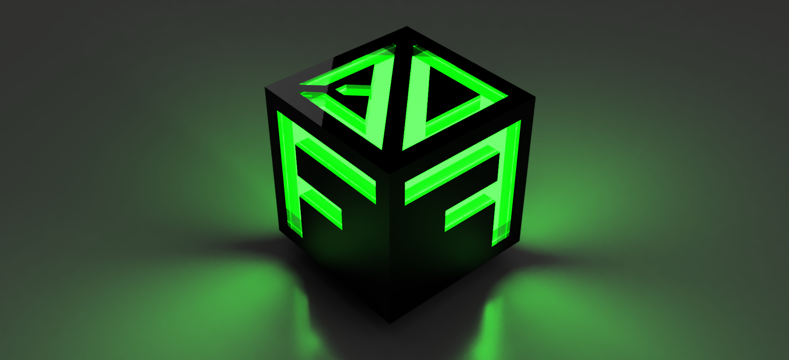

# 
FyF Impresiones 3D

Somos un emprendimiento uruguayo con más de 2 años de experiencia y más de 400 proyectos completados. Nos especializamos en la impresión 3D y la fabricación de repuestos plásticos para una amplia gama de sectores, incluyendo automotriz, agrícola, industrial y más. 

Priorizamos el diseño y utilizamos materiales plásticos resistentes y biodegradables para satisfacer las necesidades comerciales de empresas e individuos.

Tenemos acceso a una gama amplia de herramientas de fabricación digital tales como; Impresión 3D FDM y SLA, Routeado CNC (MDF, madera, metal), Escaneos 3D.

Ofrecemos servicios de diseño, modelado 3D de sólidos y mallas, tercerización de planos técnicos, fabricación de piezas, consultoría para proyectos de productos.

Más información de algunos de nuestros trabajos siguiendo los links de Facebook e Instagram en el footer de la página.
