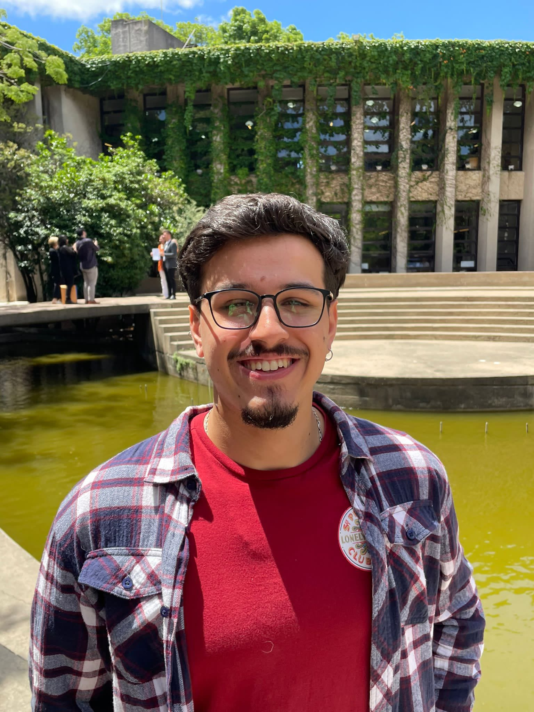

# Sobre mi

Me llamo Franco Pacilio, soy Diseñador Industrial y tengo 26 años. 

Hace ya más de 5 años que me enfoco en las tecnologías emergentes como la Fabricación Digital, el Diseño 3D y la gestión de Infraestructura Informática. 

Actualmente tengo dos principales ramificaciones; por un lado un puesto fijo en una empresa de tecnología, cómo IT Infrastructure Analyst en la que he tenido la posibilidad de crecer a lo largo de 4 años. 

Por otro lado, un emprendimiento de diseño y producción de repuestos plásticos mediante herramientas de fabricación digital diversificado en sectores tales como automotriz, mecánico, agrícola, industrial y otros, llamado FyF Impresiones 3D. En este implemento tecnologías de impresión 3D FDM y SLA. También herramientas de corte láser y scanneo 3D para diseñar y fabricar repuestos que suplan vacíos en nuestro acotado mercado industrial.

Pueden ver más información sobre mí o mis trabajos siguiendo los links a las redes sociales en el footer de la página.

¡Muchas gracias!
