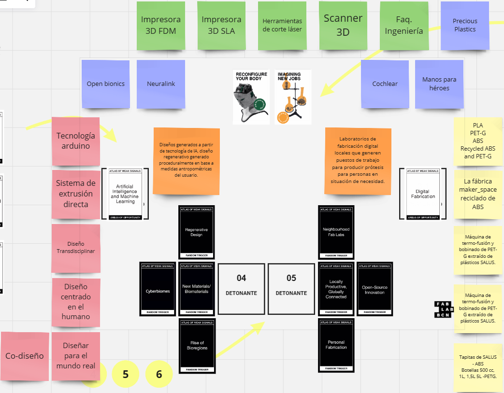

---
hide:
    - toc
---

# MD01

Para el Módulo Diseño 01 se nos propuso trabajar con las metodologías de diseño "Atlas of Weak Signals", "Alternative Presents" y "Multiscalar Design Space". Todas estas fueron documentadas y proyectadas a través del sitio web "Miro".

A continuación estaré detallando mi proceso a través del mismo.

Atlas of Weak Signals

Identificando Weak Signals:

Esta etapa consiste en seleccionar dos Weak Signals y a partir de estos agregar información al estilo lluvia de ideas de palabras clave, temáticas, ejemplos que se nos vienen a la mente mediante estas imágenes.

Personalmente elegí "Reconfigure your body" y "Imagining New Jobs". Mi elección fue meramente subjetiva; por un lado me gusta mucho la tecnología y me resulta una temática interesante el uso de la tecnología para mejorar/optimizar nuestra vida. Por otro lado considero que los avances tecnológicos pueden traer y posibilitar nuevas áreas laborales de gran impacto.

Seleccionando Áreas de Oportunidad:

En esta etapa se nos proponen diversas áreas de trabajo que se utilizan actualmente en el FabLab de Barcelona para prototipar futuros emergentes.

Seleccioné las áreas de "Artificial Intelligence and Machine Learning" y "Digital Fabrication". En este caso, mi elección fue objetiva; podemos observar hoy en día cómo los avances tecnológicos en la IA están optimizando y mejorando cada vez más nuestra eficiencia y eficacia en el trabajo, incluso abriendo posibilidades para nuevas áreas de trabajo y automatización de procesos laborales. Lo mismo ocurre con el campo de la fabricación digital, donde cada vez contamos con tecnologías nuevas a precios más accesibles y con mejoras sustanciales una tras otra.

Resultado final del Atlas of Weak Signals

Más información en: [Miro Board de EFDI-GRUPO 4](https://miro.com/app/board/uXjVKQD5ciI=/)

¡Muchas gracias por su atención!

<meta charset="UTF-8">
    <meta name="viewport" content="width=device-width, initial-scale=1.0">
    <title>Texto Arcoíris</title>
    
