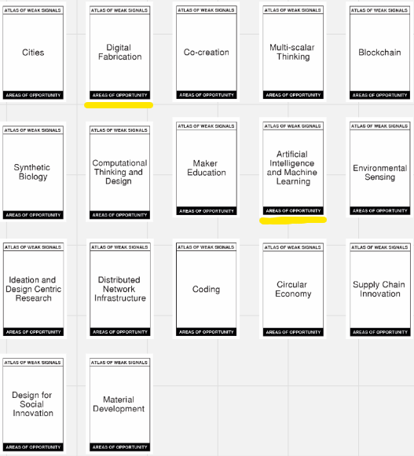

---
hide:
    - toc
---

# MD01

Para el Módulo Diseño 01 se nos propuso trabajar con las metodologías de diseño "Atlas of Weak Signals", "Alternative Presents" y "Multiscalar Design Space". Todas estas fueron documentadas y proyectadas a través del sitio web "Miro".

A continuación estaré detallando mi proceso a través del mismo.

Atlas of Weak Signals

Weak Signals:

Esta etapa consiste en seleccionar dos Weak Signals y a partir de estos agregar información al estilo lluvia de ideas de palabras clave, temáticas, ejemplos que se nos vienen a la mente mediante estas imágenes.

Personalmente elegí "Reconfigure your body" y "Imagining New Jobs". Mi elección fue meramente subjetiva; por un lado me gusta mucho la tecnología y me resulta una temática interesante el uso de la tecnología para mejorar/optimizar nuestra vida. Por otro lado considero que los avances tecnológicos pueden traer y posibilitar nuevas áreas laborales de gran impacto.

Áreas de Oportunidad:

En esta etapa se nos proponen diversas áreas de trabajo que se utilizan actualmente en el FabLab de Barcelona para prototipar futuros emergentes.

Seleccioné las áreas de "Artificial Intelligence and Machine Learning" y "Digital Fabrication". En este caso, mi elección fue objetiva; podemos observar hoy en día cómo los avances tecnológicos en la IA están optimizando y mejorando cada vez más nuestra eficiencia y eficacia en el trabajo, incluso abriendo posibilidades para nuevas áreas de trabajo y automatización de procesos laborales. Lo mismo ocurre con el campo de la fabricación digital, donde cada vez contamos con tecnologías nuevas a precios más accesibles y con mejoras sustanciales una tras otra.

Conceptos Detonantes:

Los conceptos detonantes serán palabras clave o campos de investigación con los que estaremos trabajando y prototipando. Su objetivo es ayudarnos a disparar oportunidades o relaciones que aún no habíamos pensado.

A mí particularmente me sucedió que al presentarnos una cantidad tan grande de conceptos, me resultó dificil reducirlos a solamente 2. Pero lo que hice fue separarlos en dos categorias de conceptos que presentan cierta armonía entre sí; una más inclinada al mundos de las Inteligencias Artificiales y el otro relacionado a la Fabricación Digital.

Adicional

Por último, se nos sugiere incluir diferentes tipos de referencias diagramadas por color que nos ayudarán a disparar, conectar y/o expandir las ideas. Estas son:

Referencias y personas inspiradoras

Materiales de nuestra preferencia

Recursos útiles cercanos

Tecnologías y/o metodologías

Resultado final del Atlas of Weak Signals

Alternative Presents

La próxima herramienta que utilizaremos tiene como objetivo describir presentes alternativos que emergen de un proyecto o idea de nuestro espacio de diseño Atlas of Weak Signals.

Esta herramienta se compone de tres principales secciones: 

Continuidades actuales 
Describir el presente con el que no estamos de acuerdo

Presentes alternativos 
Describir el futuro (nuevo presente) al que queremos avanzar

Acciones de diseño 
Describir qué acciones debemos realizar para alcanzarlo

Considero que la idea aún posee demasiadas vertientes, esto la hace dificil de aproximar a la realidad. Todavía hace falta bajarla a tierra y acotarla, pero me resulta una iniciativa interesante qué podría resultar en una nueva línea de producción de material reciclado para fines médicos sociales de gran impacto para nuestro país.

Multiscalar Design Space

La tercer y última herramienta del MD01 es el Espacio de Diseño Multiescalar. Este es una mesa de trabajo que proporciona herramientas y recursos para diseñadores, estudiantes y profesionales que buscan abordar las crisis actuales en diversos sistemas de nuestro planeta. Utilizando la metodología de mapeo multiescalar, este espacio permite explorar cualquier tema de interés en una amplia gama de escalas. Se trata de una colección física o digital que incluye experimentos, proyectos, productos y materiales que respaldan la investigación y la acción. Este espacio integra prototipos y proyectos previos, junto con información obtenida de activaciones autorreflexivas, proporcionando así una amplia variedad de posibilidades concretas de intervención y acción.

Personalmente, me enfoqué en el área de la fabricación digital y/o el uso de plásticos para su reciclaje. Que se entrelaza con la posibilidad de nuevas áreas de conocimiento y puestos de trabajo a medida que se avanza a una realidad más sustentable.

Desde mi perspectiva personal, el conjunto de herramientas del MD01 me brindó resultados muy positivos. Me permitió explorar nuevas ideas y abordar diferentes áreas, desde la tecnología hasta los aspectos sociales y medioambientales.

El MD01 me ayudó a ejercitar al creatividad, guiándome hacia soluciones innovadoras y desafiándome a pensar más allá de lo convencional. La combinación de enfoques me inspiró a considerar cómo estas áreas pueden converger para enfrentar los desafíos actuales y futuros.

En resumen, el MD01 no solo me proporcionó herramientas prácticas, sino también una mentalidad curiosa y abierta que me llevó a explorar nuevas posibilidades y maneras de contribuir de forma significativa en la búsqueda de soluciones transformadoras.

Más información en: [Miro Board EFDI-GRUPO 4](https://miro.com/app/board/uXjVKQD5ciI=/)

¡Muchas gracias por su atención!

<meta charset="UTF-8">
    <meta name="viewport" content="width=device-width, initial-scale=1.0">
    <title>Texto Arcoíris</title>
    
