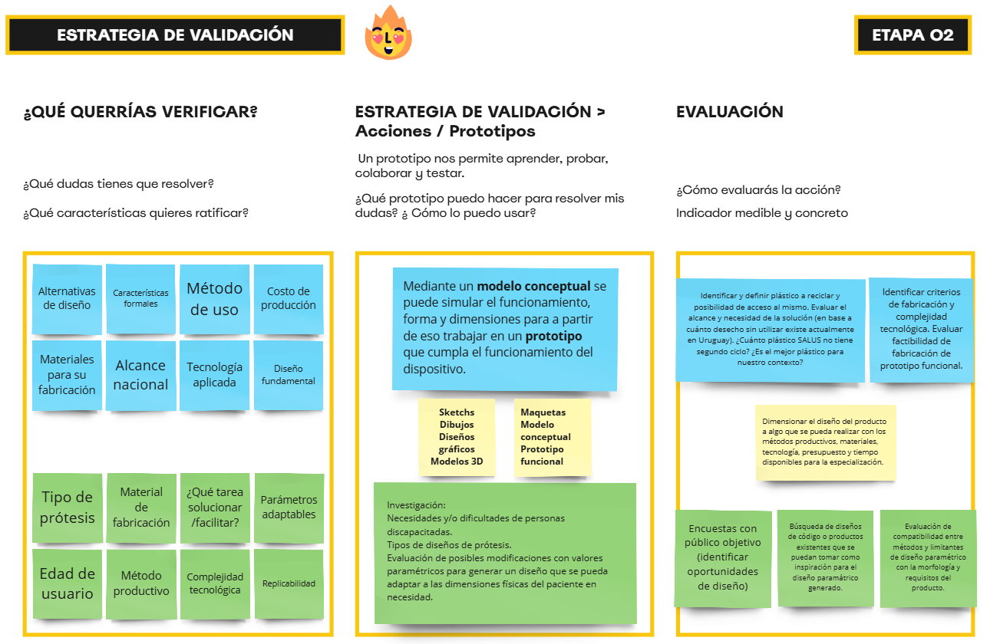

---
hide:
    - toc
---
<meta charset="UTF-8">
    <meta name="viewport" content="width=device-width, initial-scale=1.0">
    <title>Texto Arcoíris</title>
    
# MD02

El presente Módulo Diseño 02 se compone por dos etapas. En la primera etapa utilizamos las herramientas "Propuesta de Valor" y "Jam Session", en la segunda etapa utilizamos "Idea de Proyecto" y "Estrategia de Validación". Ambas etapas enfocadas en ayudarnos a bajar a tierra puntos importantes para definir la idea que estaremos trabajando en el resto del Posgrado.

Propuesta de Valor:

La herramienta busca que generemos diferentes tipos de definiciones, tales como el problema que queremos solucionar, la propuesta de valor, referencias y contexto. Personalmente aún no logré tomar la decisión de cual de las dos propuestas que tengo voy a llevar a cabo, por lo que esta herramienta me es de gran ayuda para realmente entender a fondo las ideas y ayudarme a elegir un camino.

Utilicé diagramas de colores para diferenciar una propuesta de la otra, referencias que utilizaré durante todo el MD02.

Esta herramienta fue de gran ayuda para empezar a profundizar en las ideas; identificar un cierto "Público objetivo", su comportamiento y necesidades.

Jam Session:

Personalmente se me dificultó encontrar puntos Fáciles o Imposibles pero Irrelevantes. Creo que uno no está acostumbrado a pensar y encontrar ideas que no son relevantes, no lo sé. Quizás no entendí correctamente qué tipo de disparadores incluir en esas secciones.

Idea de Proyecto:

Aproveché la oportunidad para generar una búsqueda de concepto de producto, para poder visualizar un posible resultado final.

Estrategia de Validación:

[Link de acceso a fuente de datos](https://miro.com/app/board/uXjVK9Q-_oY=/)

Conclusiones y Reflexiones:

Las actividades y herramientas propuestas para el MD02 me fueron de gran ayuda para "darle forma" a la idea, abarcando conceptos más formales y contextuales fue posible visibilizar posibles resultados de los caminos planteados.

¡Muchas gracias por su atención!

