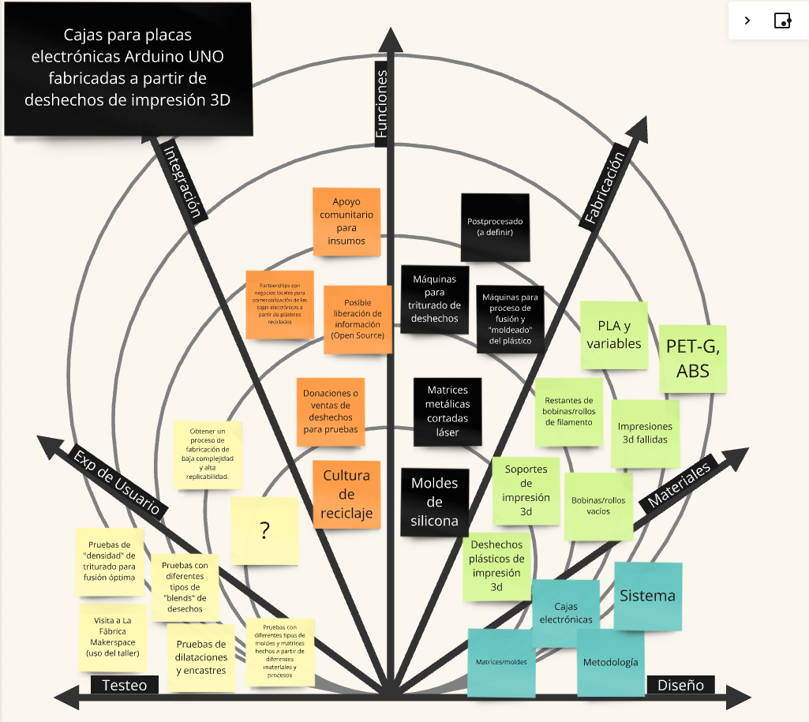
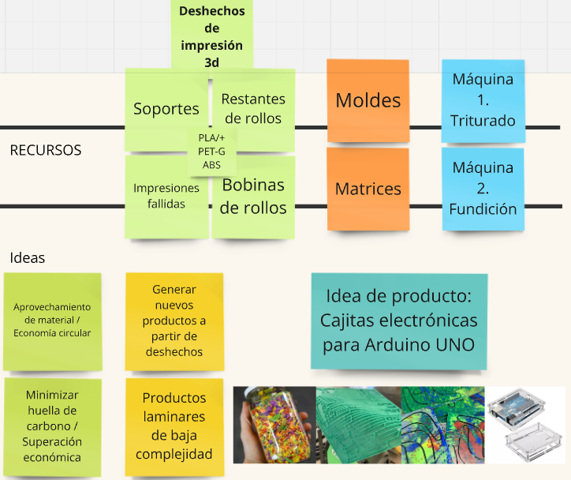
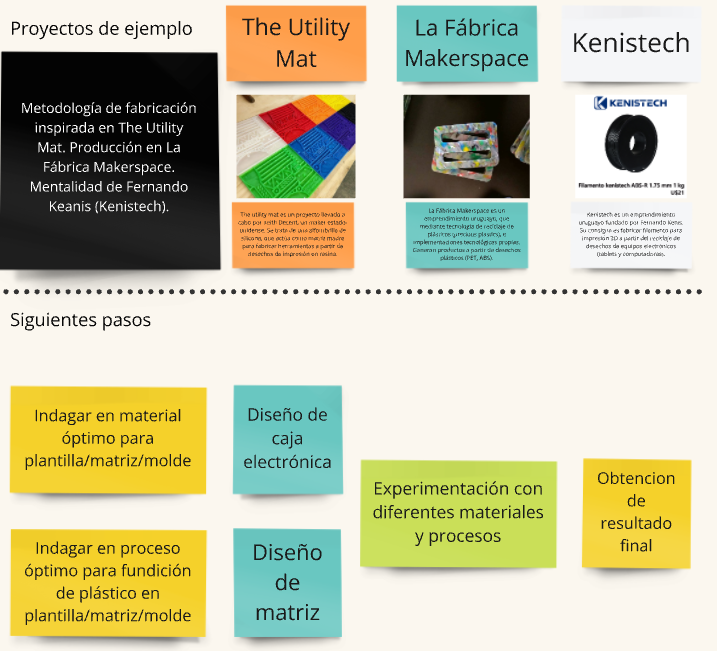
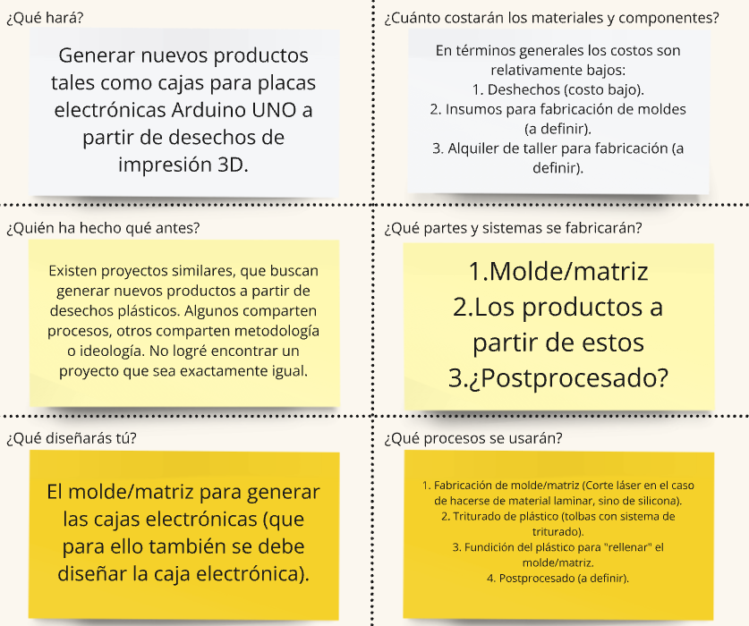
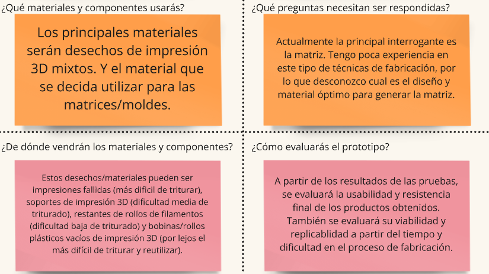
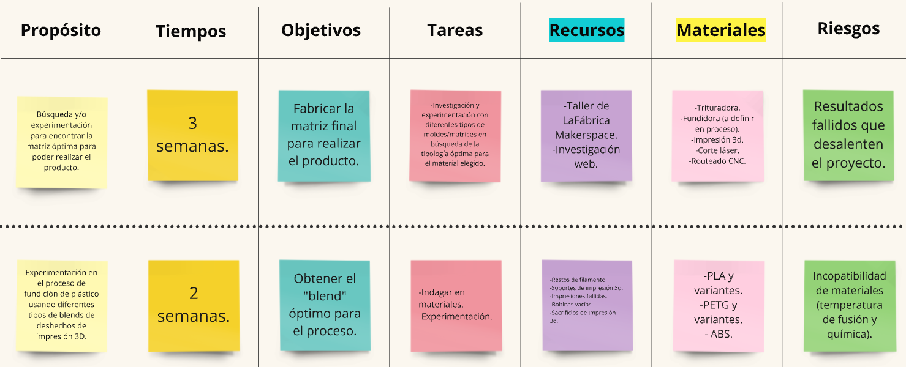
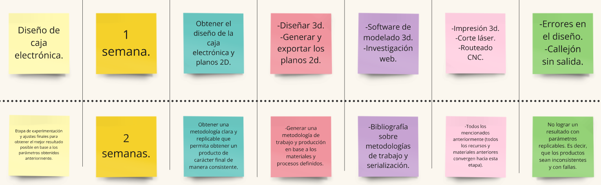

---
hide:
    - toc
---
<meta charset="UTF-8">
    <meta name="viewport" content="width=device-width, initial-scale=1.0">
    <title>Texto Arcoíris</title>
    
# MD03

El Módulo de Diseño 03 se enfocó en concretar las ideas desarrolladas a lo largo del posgrado, con el objetivo de definir una línea de desarrollo final que seguiremos durante el resto del curso.

En mi caso, optaré por una línea de desarrollo diferente a las abordadas en los módulos de diseño anteriores. Mantendré el enfoque en el reciclaje y reutilización de deshechos de impresión 3D, pero en lugar de centrarme en el proceso de fabricación de material reciclado, cambiaré el enfoque hacia la creación de un producto a partir de estos desechos.

Tabla de desarrollo

El reto que me planteé es aprovechar los desechos de impresión 3D para fusionarlos mediante calor y crear una placa de material reciclado. Posteriormente, a través de un proceso de mecanizado, estas placas serán transformadas en cajas (generadas a partir de tapas laminares encastradas) para placas electrónicas. Actualmente, estoy evaluando si enfocarme en cajas para Arduino UNO o Raspberry Pi. La mayor incógnita que aún estoy explorando es el proceso productivo más adecuado para obtener estas placas recicladas.

Preguntas clave

Tabla de producción

Conclusiones y reflexiones

Como mencioné anteriormente, la principal incógnita radica en la elección del proceso productivo más adecuado para obtener las placas de material reciclado. Las opciones actuales son las siguientes:

Triturar los desechos de impresión 3D, para luego fusionarlos mediante calor y generar una placa utilizando métodos como el "Sheet Press" de Precious Plastics o las "Sublimadoras" empleadas en La Fábrica Makerspace, un emprendimiento con sede en Montevideo, Uruguay, enfocado en el reciclaje de plásticos, basado en la metodología open-source de Precious Plastics.

Triturar los desechos de impresión 3D, fusionarlos mediante calor y darles forma en una matriz, que puede ser de silicona o metal. Este método presenta diversas variantes; la matriz puede ser plana o tridimensional, y los materiales de la misma pueden incluir metal, silicona o yeso, según las necesidades. La fusión del material se puede realizar en un horno o mediante una caldera a baño maría.

En las próximas semanas estaré experimentando con estos métodos, con el objetivo de definir un proceso productivo definitivo y eficiente.

¡Muchas gracias por su atención!

