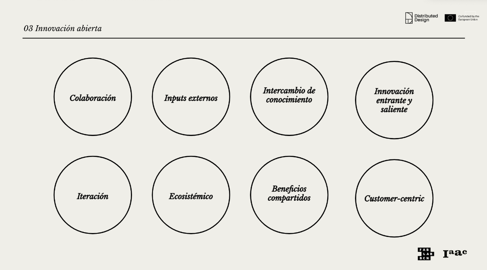
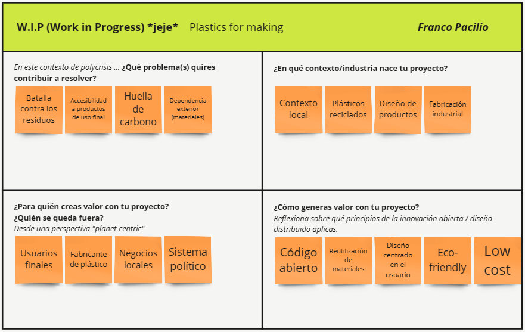
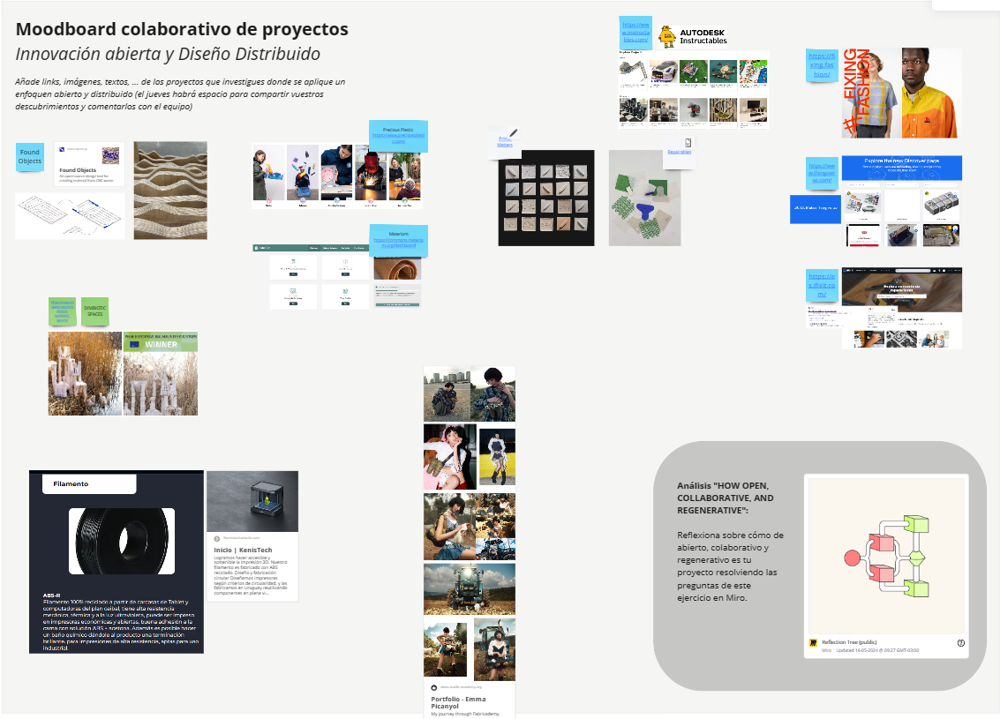
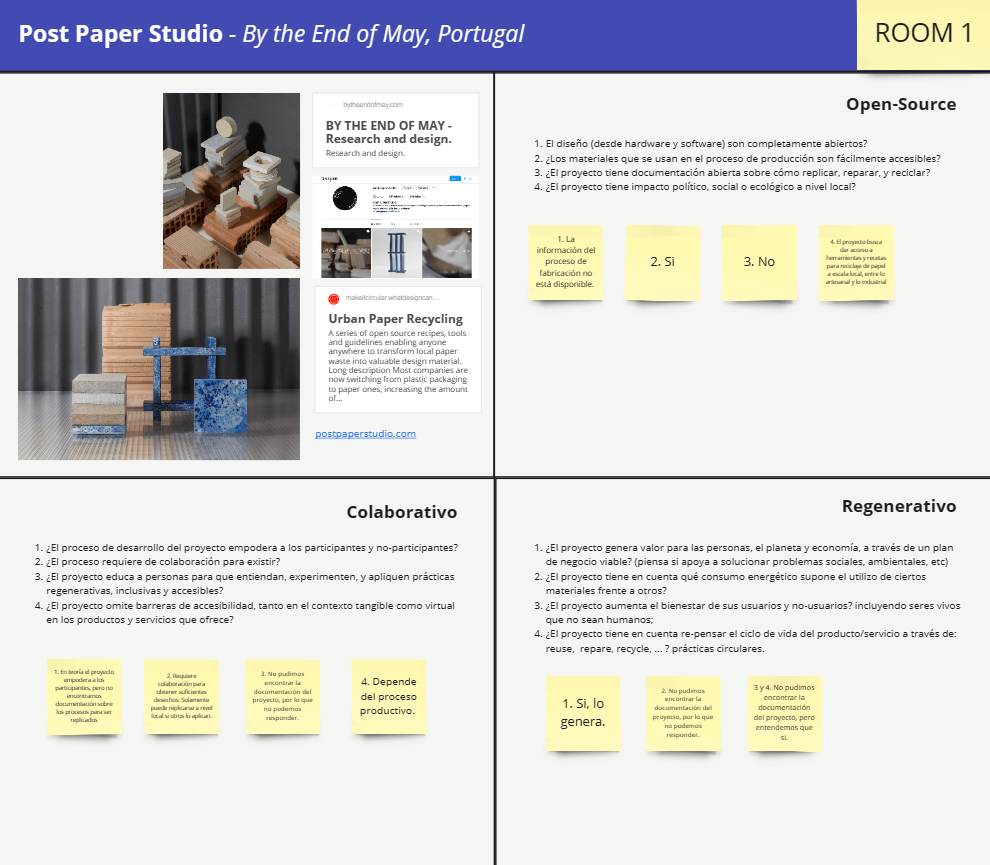

---
hide:
    - toc
---

# MI01

Innovación y Sostenibilidad

Los módulos tendrán como objetivo brindarnos herramientas para que empecemos a incorporar metodologías de innovación centradas en la sostenibilidad, aplicables en distintos ámbitos del diseño.

En el primer eje de Innovación y Sostenibilidad, presentado por Paola Zanchetta, se centró en el Diseño Distribuido y la Innovación Abierta para crear proyectos y espacios abiertos, colaborativos y regenerativos.

Para abordar esto, primero tenemos que bajar a tierra estos tres conceptos:

Mentalidad abierta (Modelos Open-Source): 
Se basa en tres principios: transparencia, replicabilidad y accesibilidad. Va más allá de la competencia, permitiendo un proceso de diseño democrático en el que todos pueden participar y acceder. Trae beneficios como la longevidad, la estabilidad y la calidad de la comunicación. Para que tenga éxito a largo plazo, necesita una documentación sólida, que describa de manera clara los procesos y resultados, facilitando así la réplica y adaptación por otros grupos y comunidades. Esta documentación debe ser abierta y accesible para asegurar que cualquier persona interesada pueda entender y aplicar las metodologías descritas.

Colaborativo (Collaborative): 
Se centra en incorporar y permitir que los ciudadanos del contexto se conviertan en miembros activos del proceso de diseño a través de enfoques colaborativos de codiseño. Esto genera empoderamiento en la comunidad y promueve soluciones de diseño diversas e inclusivas. Se involucra a la comunidad al punto de que los productos y servicios no sean creados para ellos, sino con ellos. Es esencial crear espacios de participación activa donde las voces de todos los miembros sean escuchadas y valoradas, promoviendo una verdadera colaboración. Además, es crucial realizar análisis y evaluaciones periódicas para identificar a aquellos que pueden estar quedando fuera del proceso y encontrar maneras de incluirlos, asegurando que las soluciones desarrolladas sean realmente inclusivas y representativas de toda la comunidad.

Regenerativo (Regenerative): 
El diseño regenerativo es un enfoque que no solo busca minimizar el impacto negativo en el medio ambiente, sino que aspira a tener un efecto positivo, restaurando, renovando y revitalizando los sistemas naturales. Este concepto va más allá de la sostenibilidad tradicional al centrarse en la regeneración de los recursos y la mejora de los ecosistemas y comunidades. Se basa en principios ecológicos y sistémicos, considerando a los seres humanos como una parte integral del ecosistema. Al combinar innovación con principios ecológicos profundos, el diseño regenerativo no solo busca minimizar daños, sino también reparar y mejorar los sistemas naturales y sociales, creando un futuro más resiliente y próspero. Un ejemplo concreto podría ser la implementación de prácticas agrícolas regenerativas que no solo eviten la degradación del suelo, sino que lo mejoren con el tiempo, aumentando su fertilidad y biodiversidad.

La integración de una mentalidad abierta, enfoques colaborativos y principios regenerativos en el diseño no solo promueve la innovación, sino que también asegura que las soluciones sean sostenibles y beneficiosas a largo plazo. Al adoptar estos principios, podemos crear un impacto positivo en nuestras comunidades y el medio ambiente, fomentando un futuro más inclusivo, resiliente y próspero. Estos módulos nos proporcionan las herramientas necesarias para implementar estas prácticas en nuestros proyectos de diseño, ayudándonos a construir un mundo más sostenible y equitativo.

Con esto en mente, realizamos tres ejercicios en [Miro](https://miro.com/app/board/uXjVKMo0rPU=/) para poner en práctica los conceptos aprendidos.

El primer ejercicio buscaba que de manera individual bajemos a tierra una idea de proyecto respondiendo 4 preguntas que te dirigen hacia un pensamiento crítico sobre cómo los conceptos de mentalidad abierta, diseño colaborativo y regenerativo se contemplan en la propuesta elegida.

El segundo ejercicio tuvo como objetivo que grupalmente generemos un moodboard/mesa de trabajo en el que divulguemos y compartamos diferentes referencias e inspiraciones de proyectos que consideramos que abordan las temáticas trabajadas.

Por último, se nos dividió en cuatro subgrupos, a cada uno de los cuales se le asignó un proyecto real sin conocer previamente sus detalles y especificaciones. A partir de este proyecto, debíamos investigarlo y responder una serie de preguntas categorizadas por las tres áreas del eje: Open-Source, Colaborativo y Regenerativo.

En mi caso, se nos asignó el proyecto "Post Paper Studio". Al buscar información, encontramos que se trata de un estudio que propone un método de reciclaje de papel para obtener material en forma de planchas de aproximadamente 10x10 cm, que se puedan utilizar para fabricar productos de diseño. La idea gira en torno a que este método se pueda aplicar en cualquier ciudad, donde la comunidad pueda reciclar su material y producir sus propios insumos para fabricación, sin depender de las grandes maquinarias de reciclaje.

El método busca que cualquier ciudadano, con algunas herramientas básicas, pueda triturar y prensar el papel para generar este nuevo material. También propone la idea de crear estaciones/puntos en la ciudad donde los ciudadanos puedan llevar sus desechos de papel y generar sus futuros materiales.

En teoría, la propuesta es muy interesante y, con una debida implementación social y política, puede tener grandes resultados a nivel local, empoderando a la comunidad a generar insumos para la fabricación de productos en base a sus propios desechos. Sin embargo, el gran problema que encontramos fue que el estudio de diseño que propone y difunde esta idea en ningún momento comparte información detallada sobre cómo replicar o poner en marcha este método. El proyecto dejaba de lado uno de los fundamentos de la Innovación Abierta: el Código Abierto (Open-Source). Para que los individuos o colectivos puedan actuar, es necesario que la metodología de trabajo, planos de los componentes, consideraciones e instructivos estén completamente y abiertamente detallados para todo público.

Cuando se hizo la puesta en común, este punto no fue extraño para los demás grupos; los demás proyectos fallaron en el mismo aspecto. Múltiples estudios generan ideas innovadoras con gran potencial, pero comparten poco sobre cómo realmente replicarlas. Esto abre lugar a la reflexión en torno a la propiedad intelectual y lo difícil y depredadora que es la industria del diseño y la innovación actualmente. Todos están dispuestos a generar y proponer una idea revolucionaria, pero pocos están dispuestos a compartir sus secretos. Todos queremos y buscamos la democracia hasta que nos quitan lo que es "nuestro". Al vivir en una sociedad donde debemos estar continuamente persiguiendo el éxito, es difícil soltar la idea del éxito individual y dejar entrar la idea del éxito en el servicio. Donde nuestros actos, diseños y propuestas no solo nos propulsen a nosotros, sino a cualquier persona que también lo quiera. De esto se trata la innovación abierta, de la búsqueda de superación y progreso de la sociedad como un todo, a costa del beneficio propio.

<meta charset="UTF-8">
    <meta name="viewport" content="width=device-width, initial-scale=1.0">
    <title>Texto Arcoíris</title>
    
