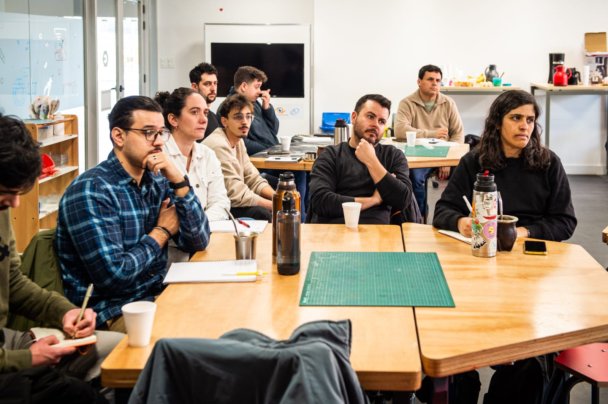

---
hide:
    - toc
---

# MI02

Desarrollo Sostenible y Economía Circular

Este módulo está diseñado para ofrecer recursos y ejemplos prácticos que faciliten la implementación de los principios de la economía circular en proyectos sostenibles. Su objetivo es fomentar un uso más consciente y eficiente de los recursos.

Ejercicios en clase

El módulo parte planteando un cuestionamiento sobre dónde nos posicionamos en la sociedad desde un punto de vista tanto ético como moral respecto a nuestra postura y estilo de vida sostenible. La herramientas se llama "Mapeo Color System"

La herramienta presenta diferentes matices, yendo desde lo más sustentable, hasta lo menos.

Personalmente, considero que llevo un estilo de vida sustentable en varios aspectos distintos a los mencionados en la consigna. Consumo carne, pero la aprovecho al máximo y procuro apoyar el mercado local. Compro ropa en tiendas convencionales o ferias, y no la descuido ni desecho fácilmente; la cuido, y si ya no me sirve el talle, prefiero donarla a personas en situación de necesidad en lugar de venderla a tiendas de segunda mano. También me esfuerzo en gestionar mis residuos de forma consciente: nunca arrojo basura en la vía pública, separo mis desechos y trato de darles una segunda vida. Puede que no sea vegetariano, ni ande en bicicleta eléctrica o abrace a los árboles, pero tengo conciencia de mi impacto y busco que este sea lo menos dañino para el planeta y la vida de los demás.

En esta etapa del ejercicio ya empezamos a bajar un poco a tierra algunos conceptos de intereses sobre nuestro proyecto, sustentabilidad, alcance y objetivos.

El propósito de mi proyecto es abordar una problemática que afecta tanto a mi trabajo como al de muchas personas en el ámbito de la fabricación digital: los desechos generados por la impresión 3D. La cantidad de residuos producidos es enorme, al igual que su potencial de reciclaje. Los materiales empleados en la impresión 3D son altamente reutilizables y maleables, lo que abre un abanico de alternativas sostenibles para su aprovechamiento.

Mi objetivo es identificar una de estas alternativas y desarrollarla a fondo hasta obtener una solución que utilizando las herramientas adecuadas, sea replicable a nivel global. Aspiro a crear un modelo de reciclaje que permita transformar estos desechos en nuevos recursos útiles, promoviendo así una economía circular y reduciendo el impacto ambiental de esta industria.

Jornada LATU

El día Viernes 6 de Septiembre, en el marco de la Especialización en Fabricación Digital e Innovación, cómo cierre al Módulo Innovación 02, participamos en un taller de producción de biomateriales liderado por María Clara Freyre, Diseñadora Industrial y amiga de la Escuela Universitaria Centro de Diseño. Fue sin dudas una muy linda experiencia, llena de aprendizajes, uso de los sentidos y experimentación; ¡Parecíamos todos científicos locos dando vida a Frankestein! (En el buen sentido). 

Comparto algunas fotografías que visualizan un poco la narrativa de la actividad:

Reflexiones

¡Muchas gracias por su atención!

<meta charset="UTF-8">
    <meta name="viewport" content="width=device-width, initial-scale=1.0">
    <title>Texto Arcoíris</title>
    
