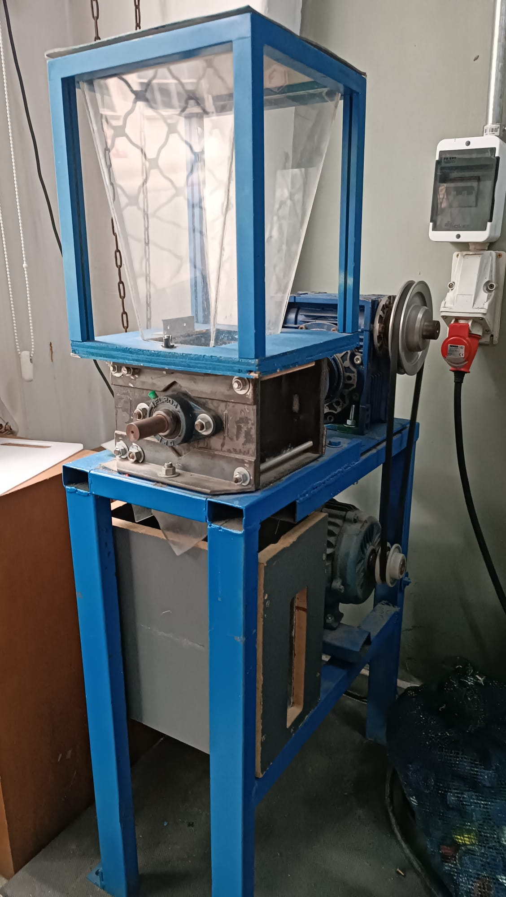
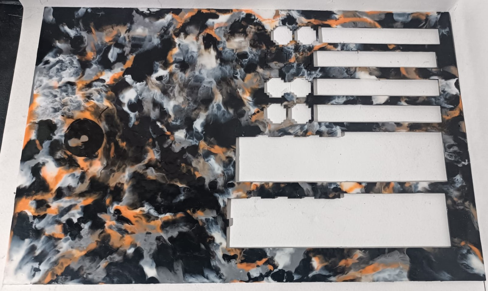

# Entrega Final

Desarrollo de un modelo de reciclaje de plásticos provenientes de desechos de impresión 3D para fabricar placas funcionales: Proyecto "EcoPlaca 3D".

## Resumen

El proyecto "EcoPlaca 3D" aborda la problemática ambiental generada por los desechos plásticos provenientes de la impresión 3D, transformándolos en placas funcionales mediante el uso de tecnologías de fabricación digital y promoviendo la economía circular. En Uruguay, el crecimiento exponencial en el uso, la comercialización y la adopción de tecnologías de impresión 3D por parte de negocios locales, emprendedores y grandes empresas ha incrementado la generación de residuos plásticos, evidenciando la necesidad urgente de implementar soluciones sostenibles. Actualmente, no existen iniciativas en el país que ofrezcan una segunda vida a estos materiales, mucho menos orientadas a su conversión en placas funcionales.

Este trabajo presenta el diseño, desarrollo y fabricación de un sistema que permite reciclar los residuos plásticos generados por la impresión 3D, transformándolos en un material práctico, funcional y con valor estético. Se describen las metodologías aplicadas, los materiales y componentes utilizados, así como las preguntas clave abordadas a lo largo del proceso. El resultado es una solución innovadora, sostenible y accesible, dirigida a diseñadores, makers y emprendedores, con un modelo adaptado a las necesidades y herramientas locales, pero con potencial de replicabilidad a nivel global.

## Introducción

El reciclaje de plásticos derivados de la impresión 3D representa un desafío significativo debido a la acumulación de residuos y la falta de un sistema eficaz para su reutilización. Este proyecto surge como respuesta a esta problemática, con el objetivo de crear un sistema replicable a nivel nacional que transforme los desechos plásticos generados por la impresión 3D en un material funcional, reutilizable en nuevos procesos productivos. Se busca, además, reducir el impacto ambiental de estos residuos y fomentar prácticas de economía circular en la comunidad de diseñadores y emprendedores, con un modelo que puede ser replicado en otros contextos del mundo.

## Objetivos

Se destacan los siguientes puntos generales y específicos:

### Objetivos Generales

Desarrollar un modelo local de reciclaje de desechos plásticos generados por la impresión 3D para transformarlos en placas funcionales reutilizables.

### Objetivos Específicos

● Crear un proceso eficiente para clasificar, triturar, fundir y moldear desechos plásticos en un material laminar reutilizable. 

● Desarrollar un sistema basado en Arduino para el monitoreo y estandarización de las condiciones de fabricación (temperatura y humedad) de las placas recicladas. 

● Generar una guía y difundir la solución entre diseñadores, makers y emprendedores, promoviendo prácticas sostenibles y modelos de economía circular. 

● Proponer alternativas de uso para el material laminar reciclado en diversos procesos de diseño y fabricación. 

## Marco teórico

El marco teórico se fundamenta en los principios de economía circular y sostenibilidad en la fabricación digital. En particular, se exploran los métodos de reciclaje de plásticos y su integración con tecnologías de fabricación aditiva (impresión 3D) y fabricación sustractiva (corte láser). El uso de sistemas de monitoreo digital, como Arduino, permite optimizar el proceso y garantizar la calidad del material reciclado. Además, se abordan iniciativas globales como Precious Plastics, un proyecto de código abierto que promueve el reciclaje descentralizado de plásticos a través de la fabricación digital.

## Antecedentes

A lo largo del tiempo, la problemática de los desechos plásticos ha impulsado diversas iniciativas enfocadas en su reciclaje y reutilización, especialmente en combinación con tecnologías de fabricación digital. Estas iniciativas han servido de inspiración para el desarrollo de soluciones que promuevan la economía circular y reduzcan el impacto ambiental.

### Antecedentes mundiales

En el ámbito global, el proyecto Precious Plastics se destaca como una de las iniciativas más relevantes. Creado por Dave Hakkens, este movimiento ofrece herramientas y conocimientos para que comunidades de todo el mundo puedan reciclar plásticos a pequeña escala. Su enfoque abarca procesos de clasificación, trituración, fundición y moldeado, con diseños modulares que permiten la personalización y escalabilidad de los sistemas. 

[Web Precious Plastics](https://www.preciousplastic.com/)

Además, otras iniciativas han explorado la reutilización de plásticos en fabricación digital, como el reciclaje de filamento para impresión 3D. Ejemplos como el Filabot y proyectos relacionados con impresión 3D circular han demostrado cómo los plásticos pueden transformarse en nuevos insumos para esta tecnología.

[Web Filabot](https://www.filabot.com/)

### Antecedentes locales

En Uruguay, el crecimiento en el uso y comercialización de impresoras 3D ha incrementado significativamente la generación de desechos plásticos, especialmente en comunidades de diseñadores, makers y emprendedores. No obstante, hasta la fecha no se han desarrollado sistemas de gestión locales que aprovechen estos desechos de manera totalmente sistemática.

Sin embargo, se destacan algunas iniciativas que abordan la temática desde puntos ideológicos similares:

La Fábrica Makerspace es un emprendimiento que forma parte de la comunidad global de Precious Plastics y generaron el primer taller de experimentación y reciclaje de plástico en Uruguay, se dedican a tomar materiales plásticos deshechados (principalmente ABS) y utilizarlos como materia prima para generar nuevos productos.

[Web La Fábrica Makersapce](https://lafabrica.uy/)

Kenistech es un emprendimiento que fabrica y comercializa filamento para impresion 3D reciclado hecho 100% a partir de plásticos de tablets, computadoras en desuso del Plan Ceibal, componentes plásticos de máquinas y periféricos (principalmente ABS).

[Web Kenistech](https://fkenistech.wixsite.com/kenistech)

Si bien existen esfuerzos relacionados con el reciclaje de plásticos, estos no están adaptados para atender específicamente los residuos derivados de la impresión 3D. Por lo tanto, el país carece de un modelo que promueva la transformación de estos materiales en productos reutilizables, lo que presenta una oportunidad única para desarrollar soluciones innovadoras y sostenibles dentro del contexto nacional.

## Descripción del proyecto

El proyecto "EcoPlaca 3D" tiene como objetivo transformar los desechos plásticos generados por la impresión 3D en placas recicladas totalmente funcionales, que pueden emplearse en diversos tipos de proyectos de diseño y fabricación. Estas placas se producen mediante un proceso que integra tecnologías de fabricación digital, como el corte láser, y promueve el cierre del ciclo de vida del plástico de forma eficiente, responsable y sostenible.

El modelo de reciclaje propuesto se adapta a las herramientas y necesidades del contexto local, brindando una solución innovadora y accesible a la problemática ambiental que representan los residuos plásticos derivados de la impresión 3D. Este enfoque no solo contribuye a la economía circular, sino que también fomenta la reutilización creativa de materiales, ofreciendo un recurso valioso para diseñadores, makers y emprendedores comprometidos con la sostenibilidad.

## Materiales y herramientas necesarias para la fabricación de las placas

● Materiales: Residuos plásticos de impresión 3D (PLA y PLA + principalmente)

● Herramientas: Trituradora de plásticos, máquina de sublimación, marcos metálicos.

● Herramientas manuales: Pinza, alicate, martillo, trincheta, equipo de protección.

● Componentes Electrónicos: Sensores de temperatura y humedad, Placa Arduino UNO, y controladores electrónicos.

## Modelo de funcionamiento

El proceso esencialmente consta de cinco pasos: selección de plásticos, triturado de plásticos, monitoreo de condiciones, fundición y moldeo, y por último, secado y desmoldeo.

### Selección de plásticos

El primer paso es seleccionar cuidadosamente los desechos de impresión 3D con dimensiones y densidad adecuadas para la trituradora, asegurando su óptimo funcionamiento. Los fragmentos deben medir, como máximo, 2 a 3 centímetros cúbicos, lo que permite procesarlos eficientemente sin sobrecargar la máquina. Se utilizarán principalmente desechos de PLA y PLA+, ya que este material es universalmente el más utilizado en impresión 3D.

#### PLA

El PLA (ácido poliláctico) es un termoplástico biodegradable derivado de recursos renovables, conocido por su facilidad de uso en impresión 3D y su baja temperatura de fusión, alrededor de 173°C. 

Este material es ideal para el corte láser gracias a su facilidad en el procesamiento, rápida solidificación y baja conductividad térmica, que permiten cortes precisos sin deformaciones ni residuos indeseados. Además, su origen sostenible y su compatibilidad con tecnologías de fabricación digital lo convierten en una opción versátil para proyectos que buscan integrar sostenibilidad y calidad.

En contraste, materiales como el ABS reciclado tienden a fundirse nuevamente durante el corte láser debido a sus propiedades térmicas, limitando su aplicación en este tipo de procesos.

#### Tipos de desechos

● Soportes: Estructuras auxiliares utilizadas para sostener partes de una impresión 3D durante el proceso, que luego se eliminan.

● Impresiones fallidas: Piezas incompletas o defectuosas generadas por errores en la impresión, como mala adhesión o interrupciones.

● Pruebas de impresión: Objetos fabricados para ajustar configuraciones y tolerancias o evaluar el rendimiento de la impresora.

● Sobrantes de filamentos: Fragmentos o extremos de filamentos que no pueden ser utilizados en nuevas impresiones debido a su longitud limitada.

Algunos de estos desechos resultan demasiado grandes y robustos, lo que requiere romperlos manualmente antes de triturarlos. Para esta tarea se utilizan herramientas como martillos, trinchetas, alicates, pinzas para metales y otros utensilios manuales, con el fin de reducir su tamaño a uno óptimo para el proceso de trituración. Este paso es fundamental para facilitar el manejo y asegurar un reciclaje eficiente.

### Sistema de Triturado

Los plásticos seleccionados y previamente fraccionados en tamaños más chicos, se introducen en la tolva de la máquina trituradora. 

La tolva utilizada está basada en los diseños desarrollados por Precious Plastic, que proporciona planos y guías detalladas para su construcción. Esta trituradora está equipada con un motorreductor que acciona un eje con múltiples cuchillas metálicas diseñadas para triturar eficazmente los plásticos. 

Dependiendo del tamaño y densidad de los desechos, puede ser necesario repetir el proceso de trituración para obtener un picadillo más fino y homogéneo.

Este proceso de refinamiento es esencial para garantizar que el material esté en condiciones óptimas para las etapas posteriores de fundición y moldeado, asegurando la calidad y consistencia del producto final. El uso del diseño de Precious Plastic no solo garantiza un rendimiento comprobado, sino que también promueve la filosofía de código abierto y sostenibilidad en el reciclaje de plásticos.

### Monitoreo de condiciones

Se emplea un sistema basado en Arduino y sensores específicos para medir y controlar las condiciones de temperatura y humedad del material reciclado antes de su fundición. Este enfoque permite establecer parámetros precisos que garantizan la consistencia y calidad del proceso, aportando fiabilidad técnica y trazabilidad. Al monitorear estas variables en tiempo real, se asegura que la metodología de fabricación de las placas sea replicable bajo circunstancias definidas, optimizando así la uniformidad del producto final y facilitando su integración en procesos estandarizados.

#### Componentes

● Placa electrónica Arduino UNO

● Pantalla LED 16X02 con Módulo I2C

● Sensor de Temperatura y Humedad DHT11

● Breadboard

● Cables conectores

#### Funcionamiento

Este sistema monitorea en tiempo real la temperatura y la humedad dentro de una bolsa hermética que contiene el material triturado (picadillo) destinado a la fabricación de placas en la máquina de sublimación. Se compone de un sensor DHT11, un Arduino Uno y un display LCD 16x2 con interfaz I2C, integrados mediante cables extendidos para ubicar el sensor dentro de la bolsa sin comprometer el aislamiento hermético.

[Link de descarga del archivo de código para Arduino IDE](https://drive.google.com/file/d/1--ZE-HsUKXdq4RrwqzampE0_MwfZQ1nH/view?usp=sharing)

#### Datos recaudados

Los datos recaudados a partir del monitoreo del picadillo de PLA dentro de la bolsa hermética indican un promedio de 65% de humedad relativa y una temperatura de 27 °C. Estos valores reflejan tanto las condiciones internas del material como la influencia directa del clima de Uruguay, que se caracteriza por niveles de humedad ambiental elevados. 

Esta información es fundamental para evaluar la necesidad de un pretratamiento del material, ya que el PLA es un material higroscópico cuya calidad puede verse afectada negativamente por la absorción excesiva de humedad. Estos datos permiten ajustar el proceso de preparación del picadillo para garantizar su adecuado desempeño en la máquina de sublimación.

### Proceso de Fundición y Moldeo

El proceso de fundición y moldeo utiliza un marco metálico, láminas de teflón reforzadas con fibra de vidrio y una máquina de sublimación para aplicar calor y presión de manera uniforme. Los desechos plásticos triturados se funden y compactan, así formando las placas recicladas.

#### Máquina de sublimación

Existen diversas tipologías de máquinas sublimadoras en el mercado. En nuestro caso, utilizaremos una prensa térmica de sublimación plana manual. A diferencia de la Sheet Press, diseñada y patentada por Precious Plastics, esta máquina es accesible comercialmente en el mercado local uruguayo. Su costo promedio ronda los 400 USD, dependiendo del tamaño y las funcionalidades.

En contraparte, la Sheet Press de Precious Plastic, es una máquina diseñada para transformar residuos plásticos en láminas recicladas de 1x1 metro. Aunque los planos y guías para construirla son de acceso libre y gratuito, su construcción requiere una inversión en materiales que ronda los 2700 USD, sin incluir costos de mano de obra ni herramientas especializadas.

Por lo tanto, aunque las prensas térmicas de sublimación son accesibles en Uruguay y pueden utilizarse para ciertos procesos de transferencia térmica, la fabricación de láminas recicladas a partir de desechos plásticos triturados, como las producidas por la Sheet Press de Precious Plastic, requiere una maquinaria específica y una inversión considerablemente mayor.

#### Marco metálico

Para la generación de las placas, utilizaremos marcos metálicos con dimensiones exteriores de 400 x 300 x 1,5 mm. Estas medidas permiten crear un área interior útil de 340 x 220 mm, que servirá como espacio de trabajo para el material reciclado. Estos marcos, por ser metálicos, aseguran la contención uniforme del material durante los procesos de prensado térmico y enfriado. 

#### Láminas de teflón

La lámina de teflón reforzada con fibra de vidrio se utiliza en este proceso debido a sus propiedades antiadherentes, su resistencia a altas temperaturas y su durabilidad. Estas características evitan que el plástico fundido se adhiera a las superficies de la máquina o del marco, protegen los equipos y permiten un desmolde limpio y eficiente, asegurando así un acabado uniforme y de alta calidad en las placas recicladas.

#### Metodología de fabricación

Se coloca una lámina de teflón reforzada con fibra de vidrio en la base de la máquina de sublimación, seguida de la colocación de un marco metálico centrado sobre ella. El interior del marco se rellena con el picadillo triturado previamente procesado. Luego, se coloca una segunda lámina de teflón con fibra de vidrio sobre el material, y todo el conjunto se prensa utilizando la estructura superior de la máquina. Tras el tiempo requerido para la sublimación, se abre la máquina y se voltea el marco para repetir el prensado, asegurando un acabado uniforme en ambos lados del material.

El tiempo de sublimación varía según factores como la cantidad de material, las dimensiones del marco y la temperatura empleada. En este proceso, se utiliza un marco de 400x300x1,5mm, trabajando a una temperatura de 180 °C, con un tiempo estimado de prensado de 10 minutos por cada lado. Este método asegura que el material se funda de manera uniforme, adopte la forma deseada y garantice una placa con el material plástico correctamente compactado y condensado.

Aunque la máquina de sublimación no es una herramienta especializada para el reciclaje de plásticos, su disponibilidad, adaptabilidad y bajo costo la convierten en una opción viable para proyectos locales que buscan implementar soluciones sostenibles en el manejo de desechos plásticos de impresión 3D.

### Desmoldeo y enfriado

Se retira el conjunto completo de la máquina de sublimación y se coloca sobre una superficie plana para permitir que el material se enfríe de manera natural a temperatura ambiente. Es importante situar un peso plano y uniforme sobre la superficie del material con el fin de evitar deformaciones o fisuras causadas por las contracciones y expansiones que ocurren durante el proceso de enfriamiento. 

Una vez que el plástico ha alcanzado una temperatura segura, se utiliza una trincheta para repasar cuidadosamente los bordes del marco, lo que facilita la extracción de la plancha sin comprometer su integridad. Este procedimiento es crucial para prevenir daños en el producto final y garantizar que conserve la forma y calidad deseadas.

Una vez retirada la plancha del marco, generalmente quedan algunos excedentes de plástico que deben recortarse utilizando una trincheta y una regla metálica. Estos excedentes suelen estar predefinidos por el contorno del propio marco, lo que facilita su remoción. Basta con realizar un ligero corte con la trincheta siguiendo la línea marcada y, al aplicar una leve presión, la aleta sobrante se desprende fácilmente.

## Resultados obtenidos

Durante el desarrollo de este proyecto, logré obtener cuatro ejemplares de placas fabricadas a partir de desechos de impresión 3D, cada una con diferentes cualidades y niveles de acabado. Este resultado evidencia tanto las facilidades como las dificultades del proceso. Si bien la creación de estas placas no es intrínsecamente compleja, alcanzar una mayor definición y calidad en el acabado representa el verdadero desafío. Aquí es donde entran en juego las estandarizaciones, consideraciones y precauciones que deben respetarse rigurosamente a lo largo del proceso para asegurar resultados óptimos.

● *Materiales:* PLA y PLA+  
● *Colores:* Negro, Naranja, Blanco y Gris 
● *Temperatura y humedad ambiente:* Proceso aún no implementado 
● *Temperatura de sublimación:* 170° 
● *Tiempos de sublimación:* 7 minutos por lado 
● *Proceso de secado:* Temperatura ambiente en superficie plana con peso plano aplicado 
● *Marco:* 400x300x1,5mm 
● *Material del marco:* Hierro 
● *Plancha:* 340x220x1,5mm 
● *Peso final:* 175 gramos 

● *Materiales:* PLA y PLA+  
● *Colores:* Negro, Blanco, Rojo, Celeste y Gris 
● *Temperatura y humedad ambiente:* 27°, 65% 
● *Temperatura de sublimación:* 180° 
● *Tiempos de sublimación:* 10 minutos por lado 
● *Proceso de secado:* Temperatura ambiente en superficie plana sin peso aplicado 
● *Marco:* 400x300x2,5mm 
● *Material del marco:* Hierro 
● *Plancha:* 340x220x2,5mm 
● *Peso final:* 205 gramos 

● *Materiales:* PLA y PLA+  
● *Colores:* Negro, Blanco, Rojo, Celeste y Gris 
● *Temperatura y humedad ambiente:* 27°, 65% 
● *Temperatura de sublimación:* 180° 
● *Tiempos de sublimación:* 10 minutos por lado 
● *Proceso de secado:* Temperatura ambiente en superficie plana con peso plano aplicado 
● *Marco:* 400x300x2,5mm 
● *Material del marco:* Hierro 
● *Plancha:* 340x220x2,5mm 
● *Peso final:* 235 gramos 

● *Materiales:* PLA y PLA+  
● *Colores:* Negro, Blanco, Rojo, Celeste y Gris 
● *Temperatura y humedad ambiente:* 27°, 65% 
● *Temperatura de sublimación:* 180° 
● *Tiempos de sublimación:* 10 minutos por lado 
● *Proceso de secado:* Prensado en maquina de sublimación fría 
● *Marco:* 250x150x3,5mm 
● *Material del marco:* MDF 
● *Plancha:* 230x130x2,5mm 
● *Peso final:* 120 gramos 

### Conclusiones

Encontramos que, tanto para marcos de 400x300x2,5 mm como de 400x300x1,5 mm, la temperatura y el tiempo de sublimación óptimos son 180°C durante 10 minutos por lado. Este tiempo adicional permite que el material se funda, se aplane y se distribuya de manera uniforme sobre el molde. Es fundamental aplicar la máxima presión posible en la máquina sublimadora, asegurándose de que ambas caras de la sublimadora queden paralelas entre sí y con una separación acorde al espesor del marco.

Por otro lado, es importante colocar material picado en exceso antes de iniciar el proceso de fundición. De no hacerlo, el material fundido podría no alcanzar a rellenar completamente el marco, dejando espacios vacíos, como ocurrió en el ejemplar número 2.

Otro aspecto crucial para el acabado final es el secado. En el ejemplar número 2, no se colocó un peso plano sobre el material cuando aún estaba caliente, lo que provocó irregularidades significativas en la superficie final.

El material del marco debe ser metálico para evitar que el plástico se adhiera excesivamente y facilitar el desmoldeado. Además, el uso de materiales menos rígidos, como el MDF, no es recomendable, ya que tiende a expandirse y deformarse con el calor, provocando que la plancha no tenga bordes rectos, como se observó en el ejemplar número 4.

A pesar de los esfuerzos, no fue posible lograr una plancha completamente homogénea en su espesor, registrándose variaciones de ±0,25 mm (por ejemplo, en una plancha de 2,5 mm, algunas zonas alcanzaron 2,75 mm, mientras que otras midieron 2,35 mm). Esto podría atribuirse a la viscosidad limitada del PLA en su estado de fusión, que a 180°C se encuentra en un rango aproximado de 2000 a 2500 Pa·s (pascales-segundo, unidad que mide la resistencia de un material a fluir), lo que dificulta su fluidez y distribución uniforme dentro del molde. Además, el PLA presenta una contracción térmica de alrededor de 0,3% a 0,5% durante el enfriamiento, lo cual genera ligeras ondulaciones en el acabado de la placa.

Estas variaciones y deformaciones pueden minimizarse mediante un control más preciso de la temperatura, la presión y el tiempo de enfriado durante el proceso de fabricación. Para corregirlas, se puede recurrir a un proceso de acabado final con maquinaria adecuada que garantice una mayor uniformidad en el espesor. Entre los métodos industriales, se recomienda el uso de una rectificadora o una calibradora de rodillo. De forma manual, es posible emplear una lijadora orbital o una lijadora de banda para nivelar la superficie de las planchas.

## Procesos de fabricación digital utilizados

Se aplican tecnologías de fabricación aditiva, como la impresión 3D, que actúa como generadora de residuos utilizados como materia prima, y de fabricación sustractiva, como el corte láser, para el corte de marcos y el procesamiento de materiales reciclados.

### Fabricación Aditiva

La Impresión 3D desempeña un rol fundamental y complementario en este proceso. Si bien no interviene directamente en la producción de las piezas finales, resulta indispensable, ya que es la fuente de los desechos plásticos que se utilizan como materia prima en todo el procedimiento de reciclaje.

### Fabricación Sustractiva

Para el corte de los marcos metálicos, se utiliza fabricación sustractiva mediante corte láser, lo que garantiza una alta precisión dimensional, y una terminación recta y limpia en las aristas del marco.

Para el corte de las placas recicladas, se aplica la fabricación sustractiva mediante corte láser, asegurando una definición precisa de los cortes y terminaciones uniformes en las aristas del material. Dado que las placas recicladas son un material duro, el corte láser resulta un proceso ideal, ya que métodos como el uso de herramientas manuales o fresado CNC tienden a resquebrajar y quebrar la plancha.

Además, como se mencionó anteriormente, la rápida solidificación y la baja conductividad térmica del material permiten realizar cortes precisos sin generar deformaciones. Esto es principalmente posible al trabajar con PLA y PLA+, los materiales más comunes y utilizados en el mundo de la impresión 3D, lo que a su vez los convierte en los principales generadores de residuos plásticos dentro de esta industria.

#### Conclusiones

Se realizaron múltiples pruebas de corte, durante las cuales se ajustaron los parámetros de velocidad y potencia de la máquina de corte láser. El objetivo fue evaluar y optimizar dichos parámetros para lograr cortes rectos y precisos, evitando el sobrecalentamiento del material y asegurando que las piezas se desprendan fácilmente sin que el láser invada o dañe el material circundante.

Los parámetros finales son:

● *PROC SPD (Velocidad de corte):* 600 
● *TRVL SPD (Velocidad de desplazamiento entre cortes):* 1200 
● *Cut PWR (Potencia de corte):* 40% 
● *Turn PWR (Potencia de encendido):* 40% 

Cabe destacar que estos parámetros pueden variar según la marca y modelo de la cortadora láser, la potencia del láser, el tipo de máquina utilizada, el mantenimiento realizado y el estado de sus componentes. Estos factores influyen directamente en la precisión del corte final, por lo que, en otro contexto, será casi seguro necesario realizar ajustes adicionales a estos parámetros.

## Posibles aplicaciones del material

Estas placas pueden ser utilizadas de múltiples maneras, dependiendo en gran medida del objetivo, la creatividad y la innovación de cada usuario. A continuación, se profundiza en algunos caminos y posibilidades de uso para este material, con un enfoque particular en diseños realizados mediante corte láser.

### Diseños laminares

Luego de múltiples pruebas de encastres y tolerancias, se identificó que las variaciones en el espesor del material reciclado (±0,25 mm) y su retracción natural generan dificultades para lograr ajustes precisos y funcionales. La tolerancia ideal encontrada fue de 0,6 mm, lo que permitió mejorar notablemente el ajuste, aunque no resolvió por completo los problemas. Las deformaciones e irregularidades del material limitan su aplicación en diseños que requieran alta precisión dimensional, resaltando la necesidad de optimizar la homogeneidad en la fabricación de las placas. Como alternativa, se propone explorar productos donde las cualidades estéticas del material reciclado se consideren un valor agregado, destacando su carácter único por encima de la precisión dimensional.

Estas placas resultan ideales para aplicaciones donde la precisión dimensional extrema no sea crítica y donde se busque aprovechar su estética única y el hecho de ser un material reciclado. Algunas posibles aplicaciones incluyen:

● *Artículos de decoración:* cuadros, lámparas, adornos geométricos y elementos ornamentales donde las ligeras imperfecciones se integran como parte del diseño, otorgando un toque artesanal y único.

● *Posavasos y bandejas:* productos funcionales que destacan tanto por su colorido como por su origen reciclado, añadiendo un valor visual y conceptual interesante.

● *Maquetas y prototipos visuales:* especialmente en proyectos donde la alta precisión no sea imprescindible, pero se requiera un material accesible y sostenible.

● *Juguetes y puzzles decorativos:* piezas simples sin encastres ajustados, donde los colores y acabados “tie-dye” aportan una estética distintiva.

● *Carcasas y elementos decorativos:* para dispositivos o accesorios donde el valor estético y la narrativa del reciclaje primen sobre la precisión dimensional.

● *Artículos personalizados:* productos como llaveros, soportes simples y organizadores, donde el uso del corte láser permite destacar la versatilidad del material.

A pesar de las limitaciones técnicas, el acabado superficial único, los colores interesantes y el valor simbólico asociado a la reutilización de plásticos reciclados convierten a estas placas en una excelente opción para proyectos creativos, decorativos y funcionales, alineados con los principios de la economía circular y el diseño sostenible.

## Propuesta de valor

EcoPlaca 3D ofrece una solución innovadora y sostenible para transformar los desechos plásticos generados por la impresión 3D en placas funcionales reutilizables. Este proyecto promueve la economía circular mediante el reciclaje de plásticos, reduciendo el impacto ambiental y proporcionando un material útil para diseñadores, makers y emprendedores.

Los valores clave de la propuesta incluyen:

● Reciclaje funcional: Placas reutilizables de alta calidad a partir de desechos plásticos.

● Diseño único: Acabado "tie-dye" que resalta el reciclaje.

● Sostenibilidad: Contribución activa a la economía circular.

● Accesibilidad: Solución práctica y económica, fácil de replicar.

● Innovación responsable: Integración de tecnologías como el corte láser y termoformado.

En conjunto, EcoPlaca 3D proporciona una respuesta práctica al desperdicio plástico y abre nuevas oportunidades en el diseño y fabricación sostenible.

## Resultados y discusión

En el transcurso del proyecto, algunas problemáticas fueron correctamente abordadas, así como otras no. Estas son algunas de ellas:

### Preguntas Respondidas:

● ¿Es posible reciclar desechos plásticos de impresión 3D para producir materiales reutilizables de manera efectiva? 

● ¿Qué condiciones deben ser monitoreadas para garantizar la calidad del material reciclado? 

### Lo que Funcionó:

● El proceso de reciclaje generó placas funcionales de alta calidad. 

● El sistema de monitoreo basado en Arduino permitió optimizar las condiciones de producción. 

### Lo que No Funcionó:

● La variabilidad en la calidad de los desechos plásticos afectó la consistencia del material reciclado. 

● El sistema de fundición necesitó ajustes para mejorar la uniformidad del grosor de las placas. 

## Conclusiones

El proyecto "EcoPlaca 3D" demostró que es posible reciclar desechos plásticos de impresión 3D y transformarlos en un material funcional y reutilizable. El sistema es accesible, económico y aplicable a una variedad de usuarios, desde diseñadores hasta emprendedores. Sin embargo, se identificaron áreas de mejora en el control de la calidad del material reciclado y en la optimización de los procesos de fabricación.

## Glosario

● Economía Circular: Modelo de producción y consumo que promueve la reutilización, el reciclaje y la reducción de residuos. 

● Fabricación Aditiva: Proceso de creación de objetos mediante la adición de capas sucesivas de material. 

● Termoformado: Proceso de modelado de plásticos a través del calor para darles forma. 

● Precious Plastics: Iniciativa global de código abierto que promueve el reciclaje de plásticos a pequeña escala. 

## Bibliografía

● Kreiger, M. (2019). Precious Plastics: Recycling Plastics with Open-Source Technology. [PDF]. Precious Plastics. Recuperado de: https://preciousplastics.com

● Bocken, N. M. P., de Pauw, I., Bakker, C., & Van der Grinten, B. (2016). Product design and business model strategies for a circular economy. Journal of Industrial Ecology, 20(3), 383–397. https://doi.org/10.1111/jiec.12259

● Moreno, M., Chiaroni, D., & del Río, P. (2016). Towards a Circular Economy: A SWOT Analysis of the Circular Economy at the Micro-Enterprise Level. Journal of Cleaner Production, 135, 983–994. https://doi.org/10.1016/j.jclepro.2016.07.033

● Tuck, C., & Hague, R. (2014). The Role of Additive Manufacturing in the Circular Economy. Additive Manufacturing & 3D Printing, 1(1), 16–23. https://doi.org/10.1080/25734988.2014.1091807

● ISO 14021:2016. Environmental labels and declarations — Self-declared environmental claims (Type II environmental labeling). International Organization for Standardization.

● Schmidt-Bleek, F. (1994). Wieviel Umwelt braucht der Mensch? MIPS – das Maß für ökologisches Wirtschaften. Birkhäuser Verlag.

● Thompson, R. C., Moore, C. J., Vom Saal, F. S., & Swan, S. H. (2009). Plastics, the environment and human health: current consensus and future trends. Philosophical Transactions of the Royal Society B: Biological Sciences, 364(1526), 2153–2166. https://doi.org/10.1098/rstb.2009.0053

● Kunz, N., & Morell, A. (2018). Recycling Plastics: Challenges and Opportunities for Sustainable Manufacturing. Journal of Cleaner Production, 172, 2446–2457. https://doi.org/10.1016/j.jclepro.2017.10.179

● Bakker, C., & Jiang, Y. (2014). Designing the Circular Economy: From Waste to Resources. Technological Innovation for Sustainability, 1(2), 111–123. https://doi.org/10.1016/j.techsoc.2014.01.002

● Meadows, D. H., Randers, J., & Meadows, D. L. (2004). Limits to Growth: The 30-Year Update. Chelsea Green Publishing.

¡Muchas gracias por su atención!

<meta charset="UTF-8">
    <meta name="viewport" content="width=device-width, initial-scale=1.0">
    <title>Texto Arcoíris</title>
      