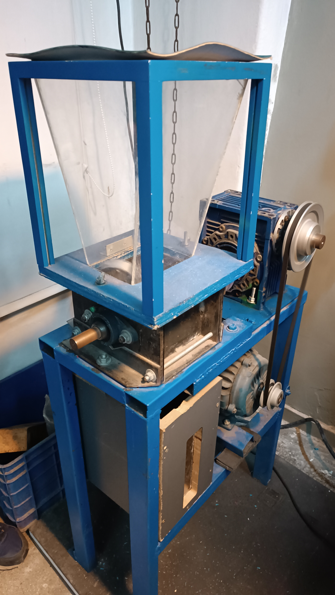
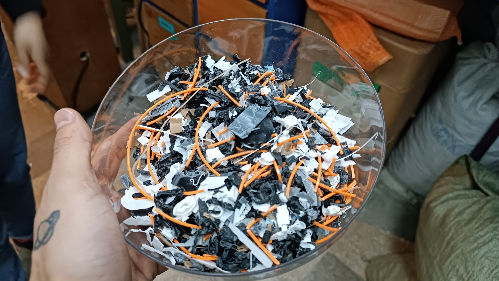
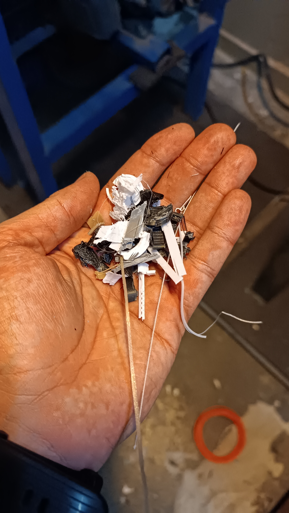
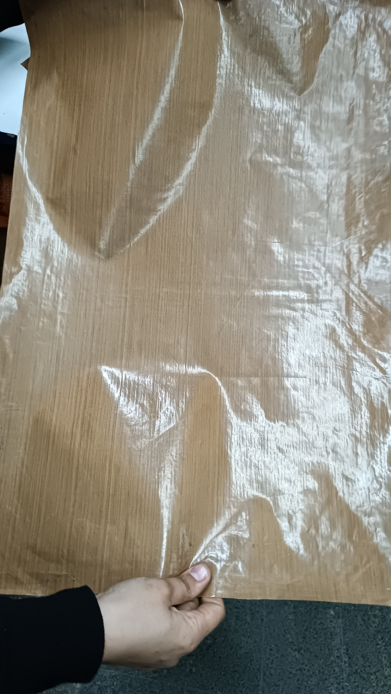
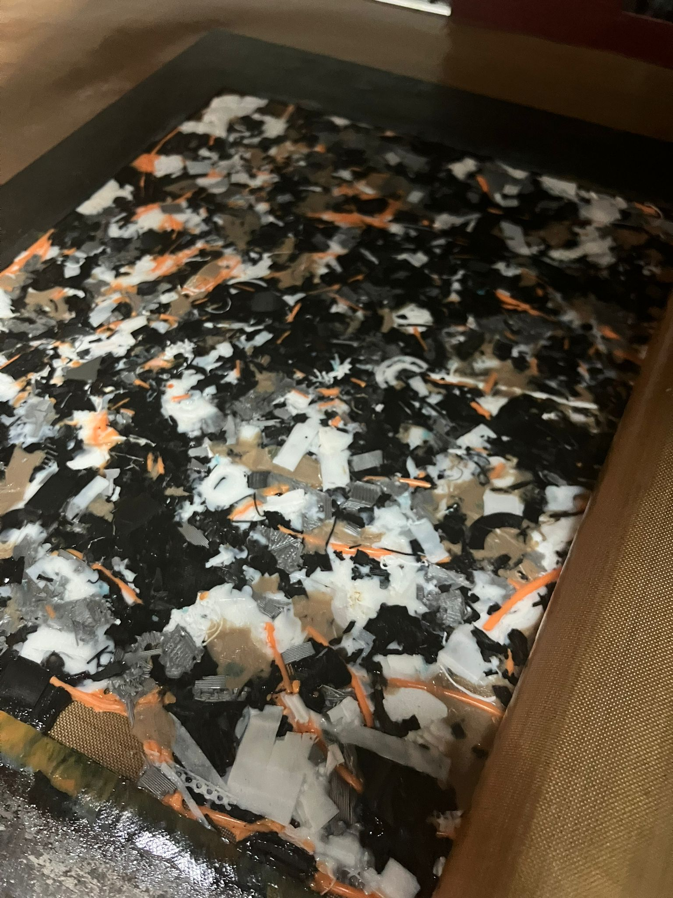
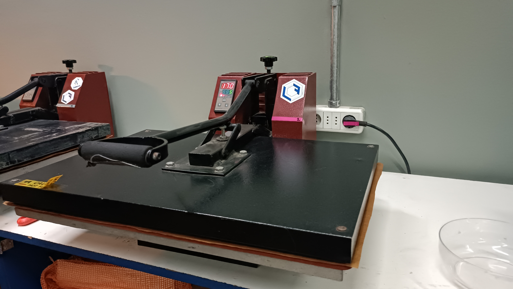
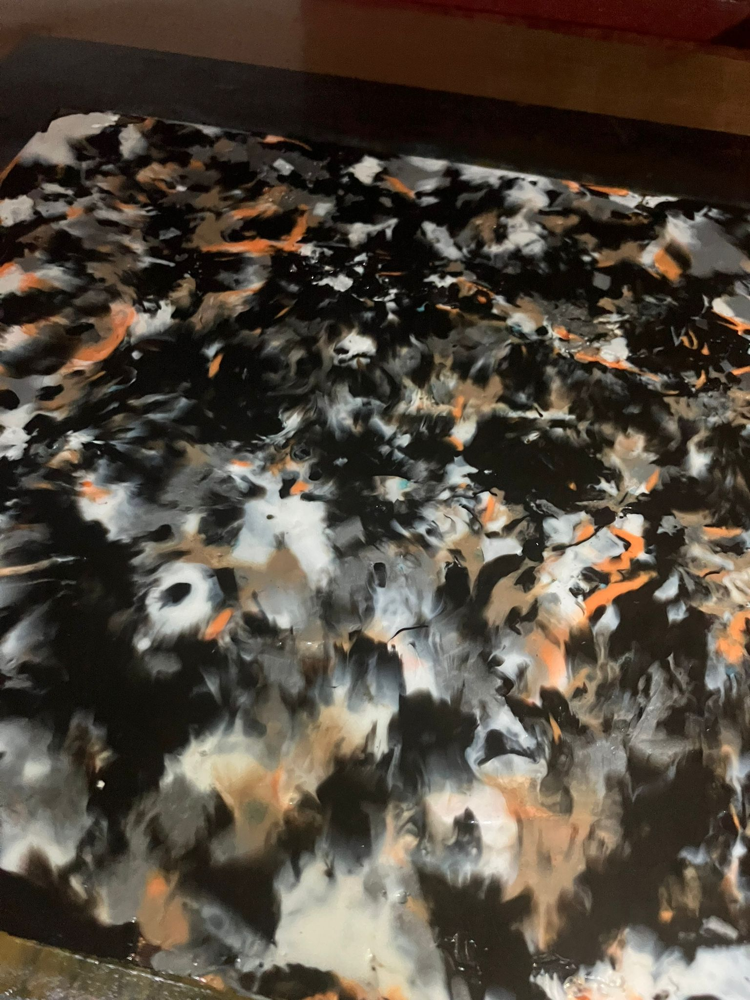
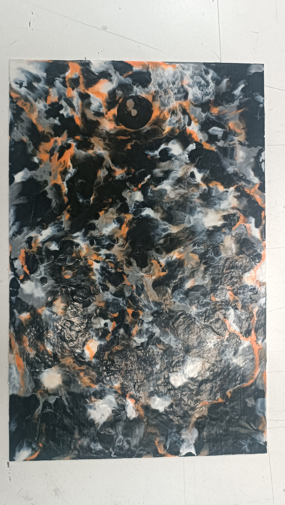
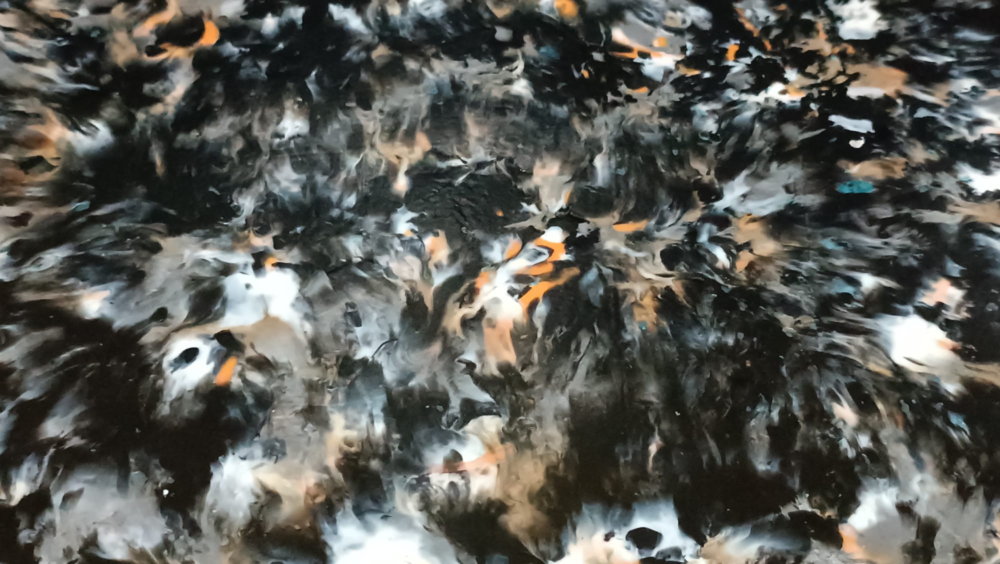

---
hide:
    - toc
---

# Desarrollo de la investigación

Junto a algunos compañeros de EFDI - Montevideo, tuvimos la oportunidad de visitar el taller de [La Fábrica Makerspace](https://lafabrica.uy/). Durante esta jornada, Vico y Fede nos recibieron con gran hospitalidad y nos introdujeron en el fascinante mundo de su trabajo. Nos mostraron las diversas máquinas y tecnologías que utilizan para la fabricación, explicando en detalle su metodología y algunos de los proyectos más destacados que han realizado en el pasado, así como los que están desarrollando en la actualidad.

La Fábrica se especializa en una metodología basada en los procesos y máquinas de código abierto de [Precious Plastics](https://www.preciousplastic.com/), adaptándolos ingeniosamente a sus propias necesidades y contextos de trabajo. Este enfoque les permite innovar y contribuir activamente a la economía circular, reutilizando materiales que de otro modo serían desechados.

Para mi proyecto, comencé utilizando su trituradora de plástico y la máquina de sublimación, con las que logré transformar desechos de impresión 3D en una placa sólida de 338x219x15 mm. Este proceso no solo me permitió reciclar material de manera eficiente, sino que también abrió nuevas posibilidades para el desarrollo de productos sostenibles.

Proceso de fabricación

Como se menciona anteriormente, el proceso esencialmente consta de cuatro pasos: seleccionar los desechos, triturar los plásticos, fundir y moldear mediante una máquina de sublimación, y, finalmente, desmoldar y enfriar. Cada etapa es crucial para asegurar la calidad del producto final y optimizar el aprovechamiento de los materiales reciclados, fomentando así una fabricación más sostenible y eficiente.

Selección de deshechos

El primer paso consiste en seleccionar cuidadosamente los desechos de impresión 3D que tengan dimensiones y densidad adecuadas para la máquina trituradora, de modo que se preserve su integridad y se optimice su funcionamiento. Los fragmentos seleccionados deben tener un tamaño máximo aproximado de 2 a 3 centímetros cúbicos. Esto asegura que la trituradora pueda procesar el material de manera eficiente sin sobrecargar sus componentes.

Triturado de plásticos

A continuación, introducimos los plásticos en la tolva de la máquina trituradora. Esta máquina, equipada con un motorreductor, moviliza un eje que cuenta con múltiples platinas metálicas diseñadas para triturar los plásticos de manera efectiva. Dependiendo del tamaño y la densidad de los desechos introducidos, puede ser necesario volver a triturar el mismo material para obtener un picadillo más fino y homogéneo. Este proceso de refinamiento es esencial para garantizar que el material esté en las condiciones óptimas para las etapas posteriores de fundido y moldeado.

Fundición y moldeo por sublimación

Se coloca una lámina de teflón con fibra de vidrio en la base de la máquina de sublimación, y luego se centra un marco metálico sobre ella. A continuación, se rellena el interior del marco con el picadillo triturado, se coloca otra lámina de teflón con fibra de vidrio por encima que se prensa con la estructura superior de la máquina. Tras el tiempo necesario, se abre la máquina y se voltea el marco para emparejar el otro lado del material.
Se coloca una lámina de teflón con fibra de vidrio en la base de la máquina de sublimación, y luego se centra un marco metálico sobre ella. A continuación, se rellena el interior del marco con el picadillo triturado, se coloca otra lámina de teflón con fibra de vidrio por encima que se prensa con la estructura superior de la máquina. Tras el tiempo necesario, se abre la máquina y se voltea el marco para emparejar el otro lado del material.

El tiempo de sublimación estimado depende de varias variables, como la cantidad de material colocado, las dimensiones del marco y la temperatura de sublimación utilizada. En este caso, se emplea un marco de 340x220x15 mm, a una temperatura de 170 °C, con un tiempo de prensado de entre 5 y 7 minutos por cada lado. Este proceso asegura que el material se funda adecuadamente y tome la forma deseada, garantizando así un producto final de buena resistencia.

<iframe width="560" height="315" 
        src="https://www.youtube.com/embed/rGIkDR39Tu4" 
        title="YouTube video player" 
        frameborder="0" 
        allow="accelerometer; autoplay; clipboard-write; encrypted-media; gyroscope; picture-in-picture" 
        allowfullscreen>
</iframe>

Desmoldeo y enfriado

Por último, se retira el conjunto completo de la máquina de sublimación y se coloca en un lugar adecuado para que se enfríe a temperatura ambiente. Una vez que el material ha alcanzado una temperatura segura, se utiliza una trincheta para repasar el borde del marco, facilitando así la extracción de la plancha del interior. Este cuidado en el desmoldeo es fundamental para evitar daños en el producto final y asegurar que se conserve la forma y calidad deseadas.

Resultado proceso

Este proceso culmina en la obtención de una plancha de 338x219x15 mm de PLA (ácido poliláctico) reciclado, caracterizada por un patrón estético estilo "tie-dye". Este acabado no solo añade un elemento visual interesante al material, sino que también destaca el proceso de reciclaje, convirtiendo desechos en productos con un diseño único y sostenible.

<meta charset="UTF-8">
    <meta name="viewport" content="width=device-width, initial-scale=1.0">
    <title>Embed YouTube Video</title>

<meta charset="UTF-8">
    <meta name="viewport" content="width=device-width, initial-scale=1.0">
    <title>Texto Arcoíris</title>
        

<html lang="en">

