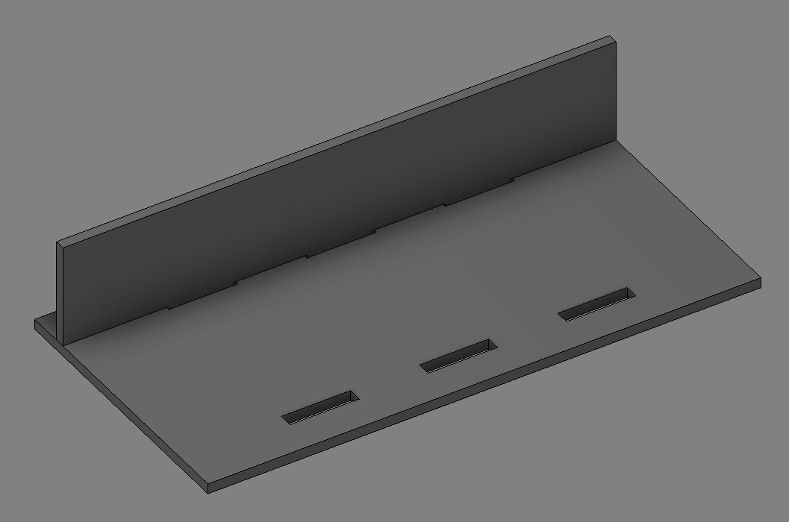
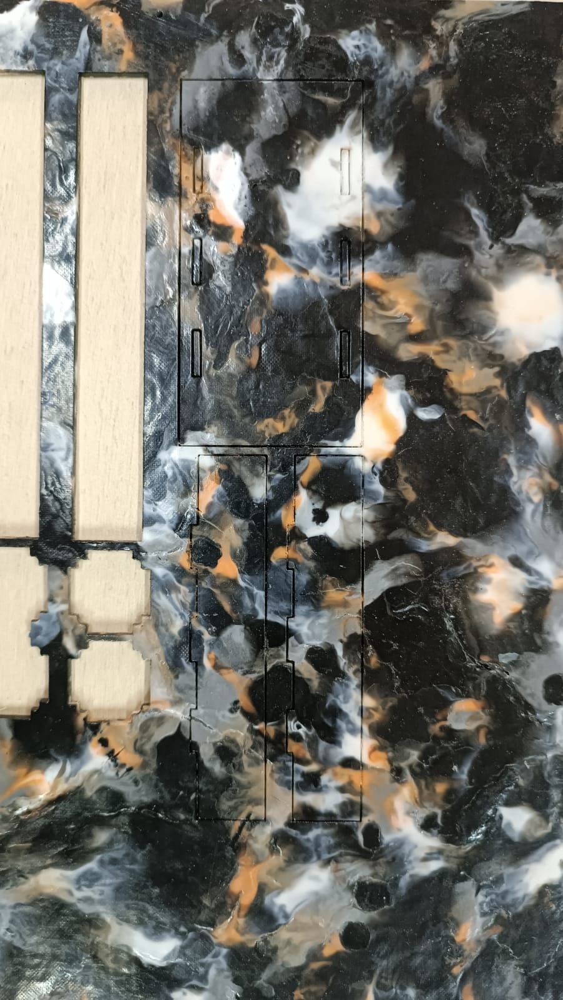
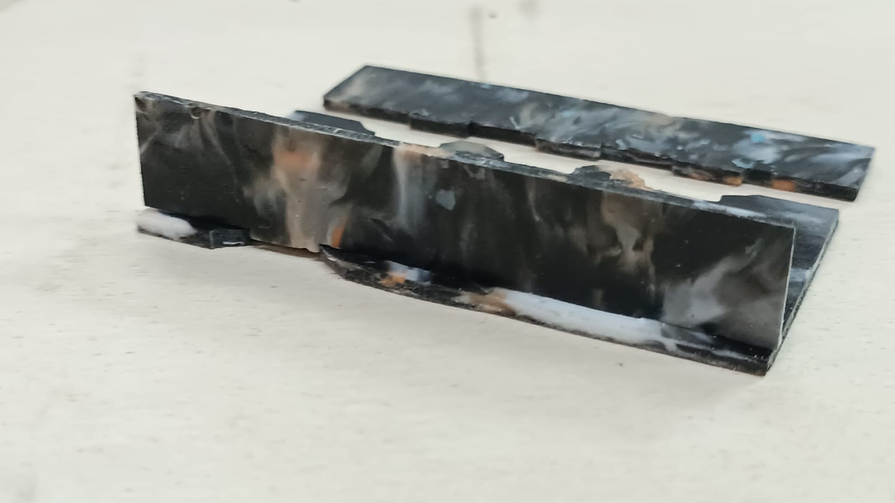
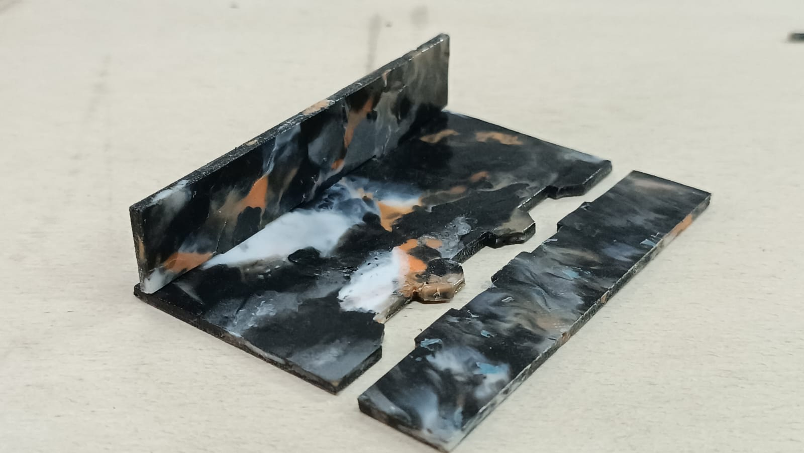
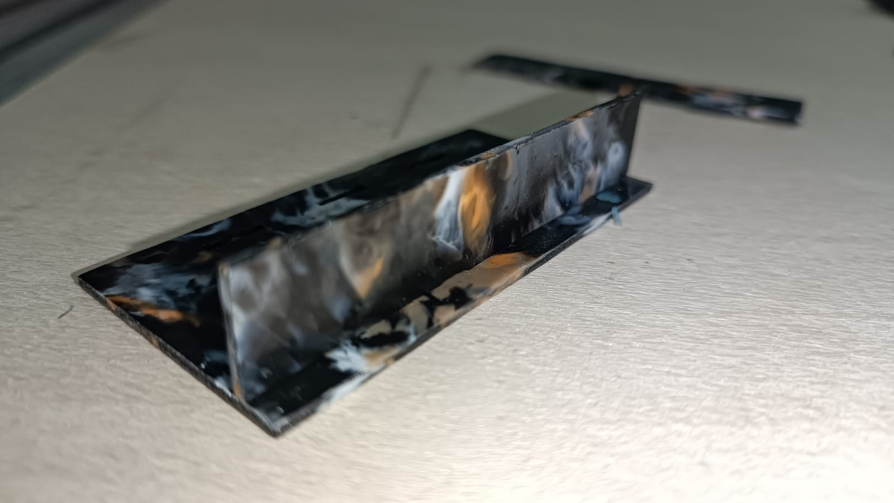

---
hide:
    - toc
---

# Pruebas con el material

Visité el taller de Andrés Parravicini en Montevideo, un espacio que está equipado con todas las herramientas manuales y eléctricas de carpintería, así como también herramientas de fabricación digital tales como Router de Fresado CNC y Cortadora Láser.

Al visitar el taller tenía los siguientes objetivos planteados:

Realizar pruebas de corte con foco en los parámetros de velocidad y potencia en la cortadora láser

Investigar pruebas de encastres con foco en los índices de expansión para tolerancias

Corte láser:

Iniciamos las pruebas utilizando los parámetros:

PROC SPD (Velocidad de corte): 1200 
TRVL SPD (Velocidad de desplazamiento entre cortes): 1200 
Cut PWR (Potencia de corte): 50% 
Turn PWR (Potencia de encendido): 50% 

Estos parámetros resultaron en un corte con demasiada potencia y una velocidad demasiado baja, lo cual causó quemaduras y sobrecalentamiento en el material. A raíz de esto, realicé pruebas con los siguientes valores:

PROC SPD: 700 
TRVL SPD: 1200 
Cut PWR: 30 
Turn PWR: 30 

Conclusiones: Potencia demasiado baja para la velocidad de corte, no atravesó el material.

PROC SPD: 700 
TRVL SPD: 1200 
Cut PWR: 40 
Turn PWR: 40 

Conclusiones: Potencia y velocidad aproximada a la ideal, pero el corte aún no se desprende facilmente.

PROC SPD: 600 
TRVL SPD: 1200 
Cut PWR: 40 
Turn PWR: 40 

Conclusiones: Parámetros de potencia y velocidad adecuados, el corte se desprende facilmente de la placa y no las deformaciones en el contorno son casi nulas.

De momento, me mantendré en estos últimos parámetros.

Encastres y tolerancias:

Diseñé una pieza hembra, en dónde generé recuadros de 10 mm x 1,5 mm, que el espesor incrementa en intervalos de 0,05 mm. En búsqueda de encontrar la tolerancia de encastre para la plancha de 1,5 mm de espesor.

Diseñé dos fichitas con machos, en dónde generé encastres de 10 mm x 2 mm, que el ancho del encaste decrece en intervalos de 0,5 mm. En búsqueda de encontrar una tolerancia de encastre para las hembras recién mencionadas.

Luego de algunas iteraciones, terminé encontrando que la mejor tolerancia es de 0,5 mm tanto en hembra como en macho.

Una vez encontrado este parámetro, pasé a realizar pruebas de encastres de machimbre, tratando de generar una especie de cajita.

Al realizar múltiples encastres consecutivos y no solamente uno, encontré nuevas dificultades que también alteran la tolerancia, que es la retracción del plástico lo cual desfasa un poco las distancias entre encastres y también las deformaciones en el material por no tener un proceso de fabricación industrial. Lo cual causó que se partan los encastres al tratas de ensamblarlo.

A raíz de esto, incrementé la tolerancia a 0,6 mm. Obteniendo un mejor resultado:

Este encastre no es perfecto, ya que por más que de un lado calce correctamente, del otro no porque justo dónde se cortó la otra pared macho, la placa tenía varaciones en el espesor, lo cual causaba que no pudiera encastrar aún con tolerancias bastante permisivas.

Conclusiones:

Estoy conforme con los resultados obtenidos pero aún queda mucho por trabajar. Debo experimentar más con el proceso de fabricación de la placa y buscar obtener una superficie y espesor más homogeneo si quiero realizar piezas con encastres.

De lo contrario, abro un espacio a cuestionamiento de qué tipo de productos quiero realizar con este material, quizás aprovechar los colores y acabado más artístico a su favor, buscando un producto que no sea tan "cuadrado".

¡Muchas gracias por su atención!

<meta charset="UTF-8">
    <meta name="viewport" content="width=device-width, initial-scale=1.0">
    <title>Embed YouTube Video</title>

<meta charset="UTF-8">
    <meta name="viewport" content="width=device-width, initial-scale=1.0">
    <title>Texto Arcoíris</title>
        

<html lang="en">