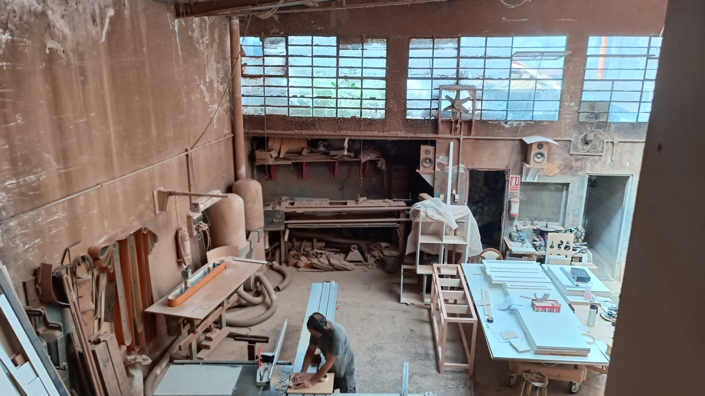
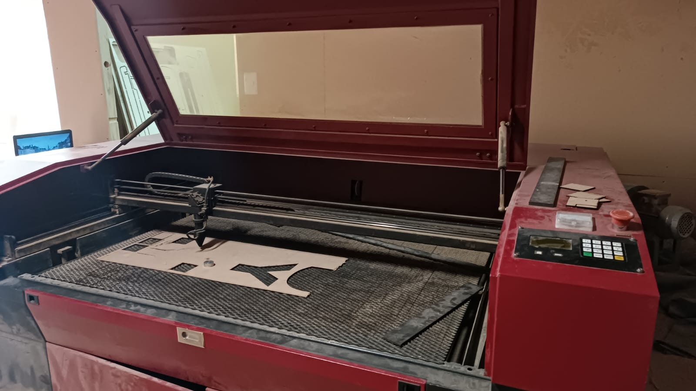
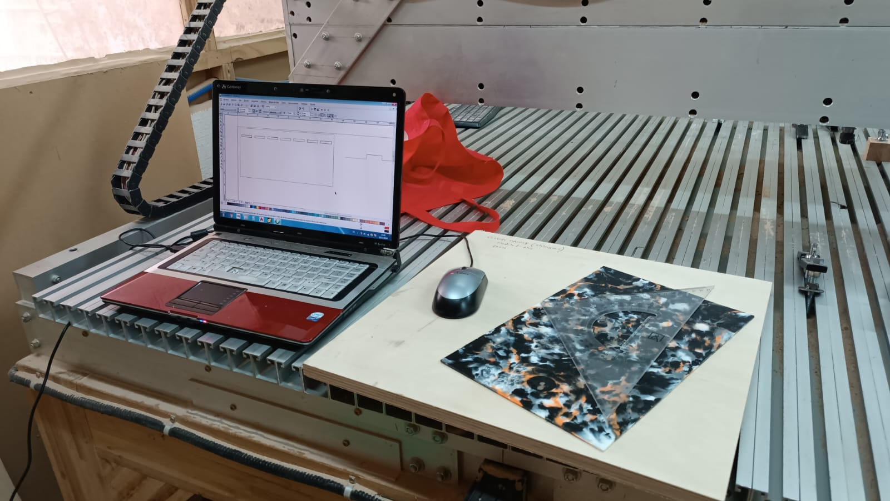
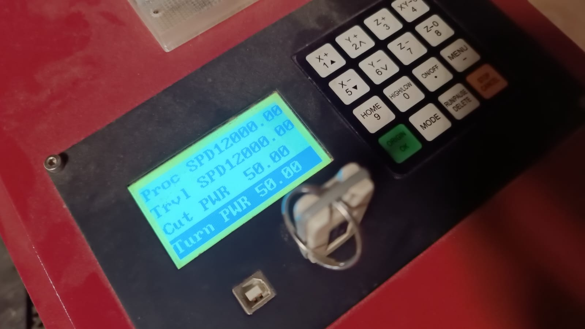
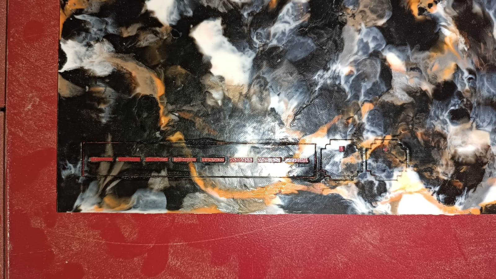
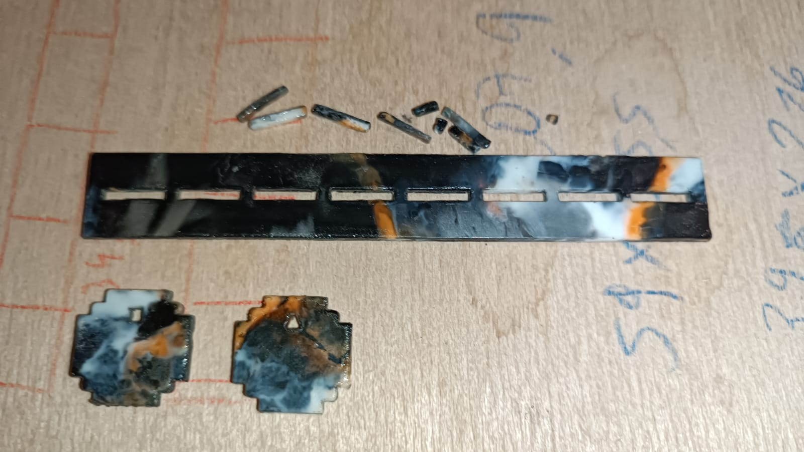
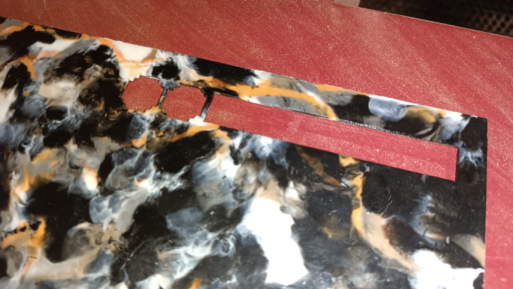
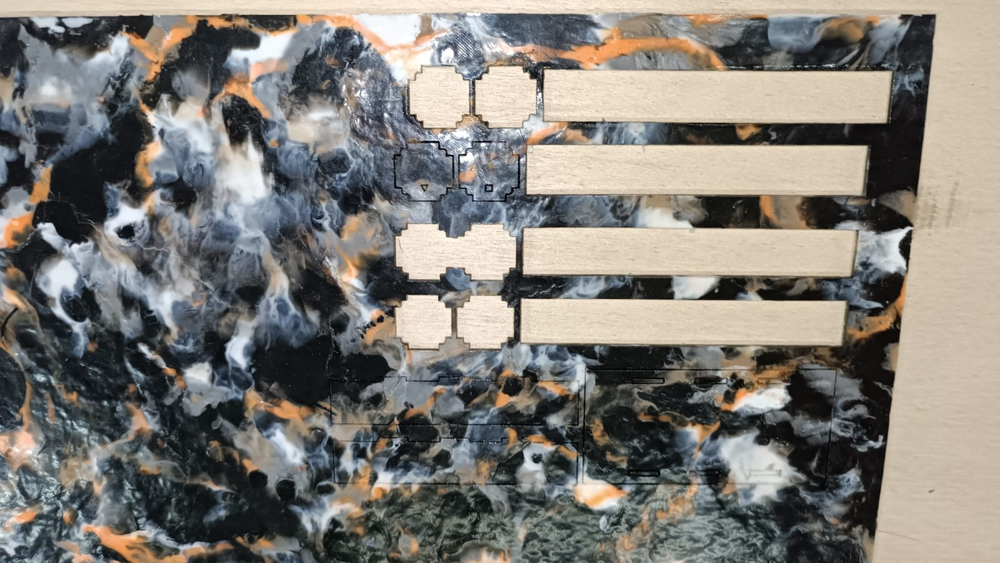
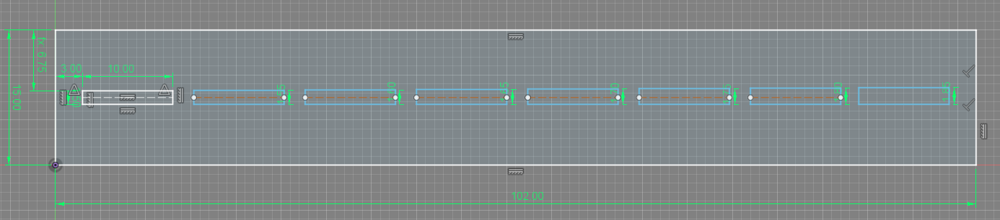
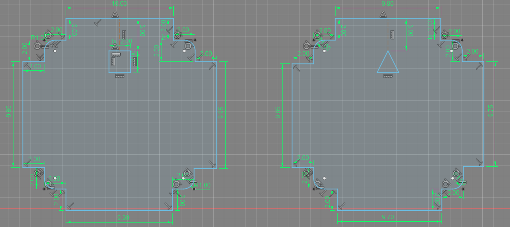

---
hide:
    - toc
---

# Pruebas con el material

Visité el taller de Andrés Parravicini en Montevideo, un espacio que está equipado con todas las herramientas manuales y eléctricas de carpintería, así como también herramientas de fabricación digital tales como Router de Fresado CNC y Cortadora Láser.

Al visitar el taller tenía los siguientes objetivos planteados:

Realizar pruebas de corte con foco en los parámetros de velocidad y potencia en la cortadora láser
Investigar pruebas de encastres con foco en los índices de expansión para tolerancias

Corte láser:

Iniciamos las pruebas utilizando los parámetros:

PROC SPD (Velocidad de corte): 1200
TRVL SPD (Velocidad de desplazamiento entre cortes): 1200
Cut PWR (Potencia de corte): 50%
Turn PWR (Potencia de encendido): 50%

Estos parámetros resultaron en un corte con demasiada potencia y una velocidad demasiado baja, lo cual causó quemaduras y sobrecalentamiento en el material. A raíz de esto, realicé pruebas con los siguientes valores:

PROC SPD: 700
TRVL SPD: 1200
Cut PWR: 30
Turn PWR: 30

Conclusiones: Potencia demasiado baja para la velocidad de corte, no atravesó el material.

PROC SPD: 700
TRVL SPD: 1200
Cut PWR: 40
Turn PWR: 40

Conclusiones: Potencia y velocidad aproximada a la ideal, pero el corte aún no se desprende facilmente.

PROC SPD: 600
TRVL SPD: 1200
Cut PWR: 40
Turn PWR: 40

Conclusiones: Parámetros de potencia y velocidad adecuados, el corte se desprende facilmente de la placa y no las deformaciones en el contorno son casi nulas.

Encastres y tolerancias:

Conclusiones: