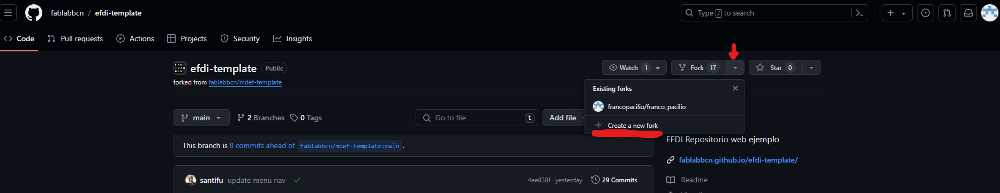
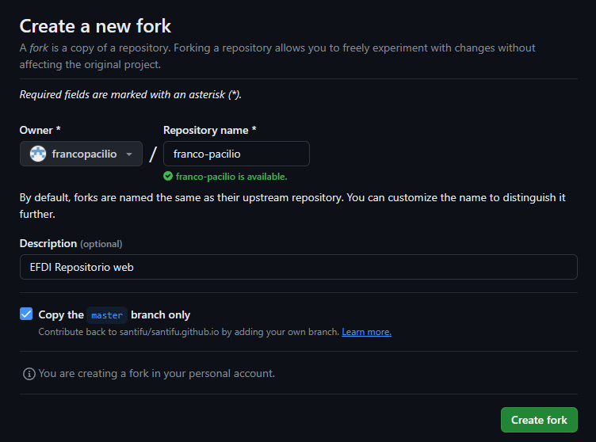

---
hide:
    - toc
---

# MT01

En esta sección estaré relatando un paso a paso de mi proceso personal para obtener esta página web en el actual módulo MT01 del posgrado.

En este proceso de aprender nuevas técnicas y herramientas, mi primer paso fue leer y comprender los recursos que utilizaré a lo largo del año. Estos recursos incluyen Git, Github y Gitbash, cuya información obtuve del curso. Además, me apoyé en preguntas específicas a recursos de inteligencia artificial como ChatGPT y CoPilot, así como en videos de YouTube. También resumí estos videos utilizando páginas que transcriben contenido audiovisual a texto, creando así mi propia biblioteca personal con los datos y terminologías más relevantes.

GitBash

Inicio el recorrido descargando e instalando GitBash de la página oficial.

Link de descarga: [Descargar GitBash](https://git-scm.com/downloads)

Luego procedo a configurar mi propio usuario y e-mail en la terminal Gitbash ejecutando los siguientes comandos: 

git config --global user.name “francopacilio”  
git config --global user-email “francopacilio98@gmail.com”

Para ver la actual configuración utilizamos el comando: 

git config --global --list

Cómo podemos ver en la imágen, el comando nos informa que el user.name y user-email quedaron setteados correctamente.

A continuación verifico si poseo alguna clave ssh mediante el comando: 

cat ~/.ssh/id_rsa.pub

Como es la primera vez que realizo esto en mi ordenador, no obtuve ninguna ssh key de ese comando. Por consiguiente, genero mi propia ssh key para mi correo eléctronico configurado anteriormente con el comando: 

ssh-keygen -t rsa -C “francopacilio98@gmail.com”

Una vez generada, podemos visualizarla con el comando: 

cat ~/.ssh/id_rsa.pub

Nos debemos asegurar que en el final de la SSH key se haga mención al correo electrónico que setteamos algunos pasos atrás, ya que es el mismo que estaremos utilizando más adelante.

¡Felicitaciones! Ya tenemos nuestra SSH Key creada y lista para utilizar.

Posteriormente podemos copiarla al portapapeles con el comando: 

clip < ~/.ssh/id_rsa.pub

Una vez hecho esto, podemos guardar la SSH Key a un bloc de notas porque la utilizaremos más adelante. Ahora debemos pasar a la próxima herramienta.

GitHub

Primero lo primero, debemos acceder a la página de [GitHub](https://github.com/)

Una vez aquí, es necesario crearnos una cuenta, la cual en mi caso me aseguré de utilizar el mismo correo electrónico que utilizamos anteriormente en GitBash.

Luego de crearnos la cuenta, debemos utilizar la SSH key que generamos en GitBash para sincronizar nuestro usuario y ordenador local con la cuenta de GitHub.

Para esto debemos navegar hacia:

[Página principal de GitHub](https://github.com/) 
Click en ícono de nuestro perfil en la esquina superior derecha
Click en settings
Click en SSH and GPG Keys
Ingresar la SSH Key que obtuvimos en GitBash
Agregar un título para identificar la Key
Click en Add SSH Key

¡Felicitaciones! Ya tenemos nuestro ordenador emparejado a nuestra cuenta de GitHub

Una vez hecho esto, debemos acceder al Repository brindado por el cuerpo docente y generar un Fork del template siguiendo los próximos pasos:

Ingresar a: [Repositorio GitHub Especialización](https://github.com/fablabbcn/efdi-template) 
Click en el dropdown menu de Fork 
Click en "+ Create a new fork"

En este caso yo ya poseo un Fork de esta página, por eso aparece mi perfil en el DropDown.

Seremos redireccionados a otra página en la que debemos asegurarnos que en Owner figure el perfil de GitHub que estaremos utilizando a lo largo del posgrado y en Repository name ingresamos nuestro nombre y apellido de la siguiente manera "nombre-apellido". Agregamos una Description que nos ayude a identificar el Repository que estaremos creando para nosotros, seleccionamos Copy the main branch only y hacemos click en "Create Fork".

¡Felicitaciones! Ya tenemos nuestro primer Repository de GitHub.

Ahora el próximo paso consiste en que generemos una carpeta local en nuestro ordenador para importar el Repository de GitHub y poder editarlo localmente mediante un editor de texto HTML de nuestra preferencia.

Yo personalmente elegí una carpeta en mi escritorio y la nombré "RepositorioLocalGithub".

A continuación debemos volver a abrir la consola GitBash y navegar hasta encontrar y ubicarnos en la carpeta que queremos importar la imágen del Repository.

En la parte superior de la consola, luego de "MINGW64:" nos muestra en qué lugar se encuentra actualmente ubicada en nuestro ordenador, en mi caso es en "C/Users/franc" y quiero llegar hasta "C:\Users\franc\OneDrive\Escritorio\RepositorioLocalGithub" (Ruta que extraemos de la barra de navegación de la carpeta que creamos)

Para hacer esto, debemos utilizar el comando "cd" que genera una acción similar a dar doble click en una carpeta, por lo que debemos especificarle mediante un nombre a cual carpeta queremos ingresar, en mi caso fue:  

cd Onedrive 
cd Escritorio 
cd RepositorioLocalGithub 
cd franco_pacilio 

Antes de ejecutar un próximo comando, debemos obtener una SSH Key del Repository que "forkeamos" en GitHub para poder realizar un Clone de ese Repository en la carpeta que navegamos a través de los comandos cd en GitBash.

Esto lo obtenemos dirigiendonos al Fork que obtuvimos anteriormente y navegando a:

Click en dropdown menu de Code 
Click en Local tab 
Click en SSH 
Click en ícono de copiar a portapapeles 

¡Ya casi llegamos ahí! Ahora debemos volver a dónde nos quedamos en GitBash y utilizar la línea de comando:

git clone "SSH Key que obtuvimos en el paso anterior"

Al darle Enter, GitBash se conectará con GitHub y generará un Clone en nuestro ordenador del Repository que obtuvimos mediante un Fork. *¡Qué linda terminología!*

¡Felicitaciones! Ahora tenemos nuestra carpeta local conectada y lista para que podamos editar los archivos y actualizarlos en nuestro Repository web mediante simples comandos.

Ahora que ya tenemos sincronizado nuestra carpeta local con nuestro repositorio web, el paso siguiente es activar el link de nuestro sitio web para que cualquier persona que posea el link, pueda accesar y ver la información que estaremos subiendo. Esto lo hacemos navegando hacia:

[Página principal de GitHub](https://github.com/) 
Ingresamos a nuestro Repository Forked from fablabbcn/efdi-template 
Click en Settings 
Click en Pages 
Seleccionamos la Branch "gh-pages" y "/(root)" para que GitHub utilice su propio servidor de páginas y nuestra carpeta raíz para ejecutar el sitio 
Click en Save 

Luego de un par de minutos GitHub habrá hecho el Deployment del sitio Web y obtendrás el URL.

¡Felicitaciones! Ya tenemos nuestra primer página en pie para poder editarla de la forma que querramos.

¿Pero cómo haremos eso? Tenemos diferentes formas, hay infinidad de herramientas, sitios web y plataformas que nos pueden aportar un amplio abanico de funciones. Incluso desde el propio GitBash tenemos comandos que nos permiten hacer diferentes tipos de funciones para interactuar con nuestro sitio.

Con el fin de realizar una práctica y entendimiento de la lógica de la herramienta, me propuse realizar un par de funciones básicas en GitBash. Estas son:

"git pull": comando que descarga la última copia del repositorio en GitHub y actualiza la versión actual del repositorio local. 

"git add": comando que agrega al área de preparación de nuestro repositorio un archivo o cambios que se le especifique en el código. 
Se lo puede complementar con un ".", es decir, "git add ." agregando todos los archivos en dónde te encuentres ubicado actualmente en la consola GitBash 
Se lo puede complementar con un nombre de archivo, es decir, "git add ejemplo.txt", agrega un archivo específico dentro de la carpeta que te encuentras ubicado actualmente en la consola GitBash. 

"git commit": guarda los cambios hechos en nuestro repositorio local y se le especifica un nombre de identificación a dicho cambio o set de cambios. 
Se lo debe complementar con un "nombre del archivo y/o ruta + nombre" y "-m nombre de la nota", es decir, git commit docs/ejemplo.txt -m "cambio a docs". 

"git push": hace el upload de mi versión del repositorio local al fork en Github. 

"git restore": descarta los cambios que hemos hecho pero aún no concretamos con el comando "push".  

"git status": verifica qué cambios se hicieron desde el último push efectuado y te informa del estado actual del repositorio local. 

En la imágen podemos ver todos los comandos relatados anteriormente puestos en ejecución para agregar un archivo nuevo desde nuestro repositorio local hacia nuestro repositorio online utilizando unicamente GitBash.

De cualquier manera, en términos de practicidad y rapidez me resulta más cómodo implementar un software que realiza estas funciones de manera más ágil, en este caso estaremos utilizando Visual Studio Code.

Visual Studio Code

Como todo nuevo software, lo primero que debemos hacer es [descargarlo](https://code.visualstudio.com/) e instalarlo en nuestro ordenador.

Una vez hecho esto, debemos abrir el programa y agregar nuestra carpeta RepositorioLocal al software como un nuevo Workspace, para hacer esto navegamos a:

Abrir Visual Studio Code 
Click en File 
Click en Add Folder to Workspace... 
Navegamos en el Explorador de Archivos hasta llegar a nuestra carpeta Main y la agregamos 

Ya tenemos nuestro Repository local sincronizado con GitHub a través de GitBash y lo estaremos editando utilizando Visual Studio Code.

Este software nos permitirá editar todos los arhivos y realizar los Add, Commit y Push todo dentro de la misma herramienta. ¡Wow! ¿Pero cómo funciona?