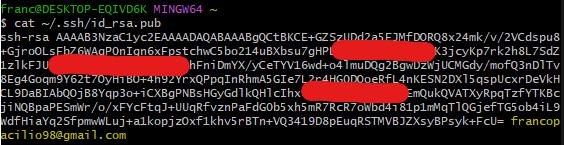

---
hide:
    - toc
---

# MT01

En esta sección estaré relatando un paso a paso de mi proceso personal para obtener esta página web en el actual módulo MT01 del posgrado.

En este proceso de aprender nuevas técnicas y herramientas, mi primer paso fue leer y comprender los recursos que utilizaré a lo largo del año. Estos recursos incluyen Git, Github y Gitbash, cuya información obtuve del curso. Además, me apoyé en preguntas específicas a recursos de inteligencia artificial como ChatGPT y CoPilot, así como en videos de YouTube. También resumí estos videos utilizando páginas que transcriben contenido audiovisual a texto, creando así mi propia biblioteca personal con los datos y terminologías más relevantes.

GitBash

Inicio el recorrido descargando e instalando GitBash de la página oficial.

Link de descarga: [Descargar GitBash](https://git-scm.com/downloads)

Luego procedo a configurar mi propio usuario y e-mail en la terminal Gitbash ejecutando los siguientes comandos: 

git config --global user.name “francopacilio”  
git config --global user-email “francopacilio98@gmail.com”

Para ver la actual configuración utilizamos el comando: 

git config --global --list

Cómo podemos ver en la imágen, el comando nos informa que el user.name y user-email quedaron setteados correctamente.

A continuación verifico si poseo alguna clave ssh mediante el comando: 

cat ~/.ssh/id_rsa.pub

Como es la primera vez que realizo esto en mi ordenador, no obtuve ninguna ssh key de ese comando. Por consiguiente, genero mi propia ssh key para mi correo eléctronico configurado anteriormente con el comando: 

ssh-keygen -t rsa -C “francopacilio98@gmail.com”

Una vez generada, podemos visualizarla con el comando: 

cat ~/.ssh/id_rsa.pub

¡Felicitaciones! Ya tenemos nuestra SSH Key creada y lista para utilizar.

Posteriormente podemos copiarla al portapapeles con el comando: 

clip < ~/.ssh/id_rsa.pub

Una vez hecho esto, podemos copiar la SSH Key a un bloc de notas porque la utilizaremos más adelante. Ahora debemos pasar a la próxima herramienta.

GitHub

