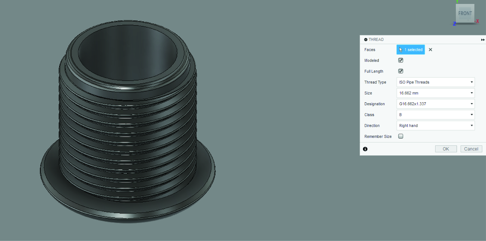
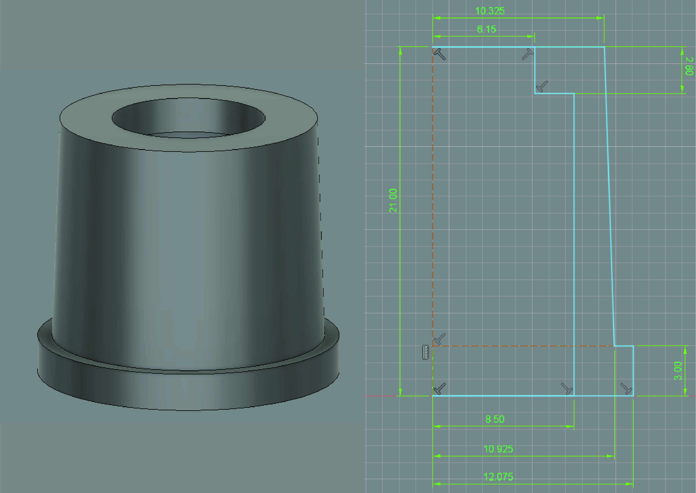

---
hide:
    - toc
---

# MT02

A continuación estaré detallando el proceso de diseño de un sistema de aspersión de líquido para un modelo de aspersora que nos encargó una ferretería del interior. Este sistema suele romperse por maluso de los operadores y el dueño de la ferretería identificó una necesidad ya que actualmente no hay repuestos oficiales para estas piezas.

El primer paso es de análisis; el sistema está compuesto fundamentalmente por 4 componentes que funcionan en conjunto para pasar de un flujo constante de líquido a una salida fina y aspersa. El cliente nos solicitó que le generemos los repuestos de manera que se puedan acoplar al codo situado a la derecha de la imágen.

Por eso el primer paso es de identificar el pase y tipo de rosca que este codo posee, para que el sistema que generemos pueda unificarse al insumo original del producto.

Una vez identificada la rosca, generamos una prueba en Fusion 360 que luego haremos una impresión para verificar su funcionamiento.

Fue necesario imprimir la pieza con un setting the Expansión horizontal de -0.3 para compensar la dilatación del plástico al imprimirse y que tenga un buen calce con la rosca original.

Una vez corroborada la rosca, continuamos con los componentes restantes del diseño.

Generamos un plano para utilizar la herramienta "Revolve" (revolución).

Agregamos aletas para facilitar el agarre y ajuste de la rosca utilizando la herramienta "Extrude" (Extrusión) y estilizamos los bordes con la herramienta "Fillet" (Chaflán).

Utilizamos la herramienta "Thread" (Rosca) para generar la rosca hembra, asegurándonos de que se corresponda el diámetro, tipo de rosca y pase con el relevado y comprobado anteriormente.

Importamos en formato SVG un dibujo 2D vectorial del logo del emprendimiento a un plano paralelo a la cara que deseamos proyectarlo. Nos aseguramos de alinear y escalar el perfil al tamaño y posición deseado.

Utilizamos la herramienta "Emboss" (Realzar) para proyectar el plano y que se ajuste a una superficie seleccionada.

Obtenemos el resultado deseado.

A continuación demostraré de manera más breve el proceso de diseño de los demás componentes haciendo mención a las principales funciones utilizadas para llegar a los resultados finales.

Utilizamos las herramientas: "Sketch", "Revolve", "Thread", "Split Body", "Extrude", "Press Pull" y "Fillet".

