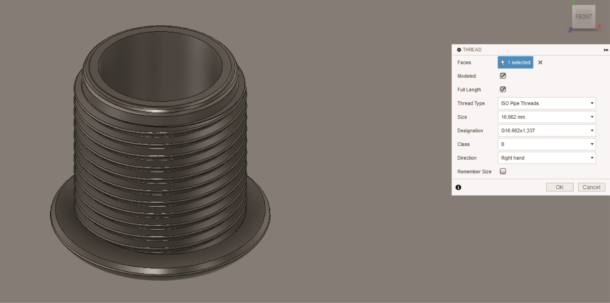

---
hide:
    - toc
---

# MT02

A continuación estaré detallando el proceso de diseño de un sistema de aspersión de líquido para un modelo de aspersora que nos encargó una ferretería del interior. Este sistema suele romperse por maluso de los operadores y el dueño de la ferretería identificó una necesidad ya que actualmente no hay repuestos oficiales para estas piezas.

El primer paso es de análisis; el sistema está compuesto fundamentalmente por 4 componentes que funcionan en conjunto para pasar de un flujo constante de líquido a una salida fina y aspersa. El cliente nos solicitó que le generemos los repuestos de manera que se puedan acoplar al codo situado a la derecha de la imágen.

Por eso el primer paso es de identificar el pase y tipo de rosca que este codo posee, para que el sistema que generemos pueda unificarse al insumo original del producto.

Una vez identificada la rosca, generamos una prueba en Fusion 360 que luego haremos una impresión para verificar su funcionamiento.

Fue necesario imprimir la pieza con un setting the Expansión horizontal de -0.3 para compensar la dilatación del plástico al imprimirse y que tenga un buen calce con la rosca original.

