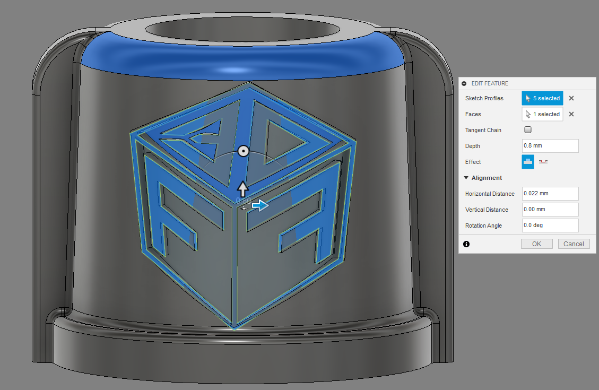

---
hide:
    - toc
---

# MT02

A continuación estaré detallando el proceso de diseño de un sistema de aspersión de líquido para un modelo de aspersora que nos encargó una ferretería del interior. Este sistema suele romperse por maluso de los operadores y el dueño de la ferretería identificó una necesidad ya que actualmente no hay repuestos oficiales para estas piezas.

El primer paso es de análisis; el sistema está compuesto fundamentalmente por 4 componentes que funcionan en conjunto para pasar de un flujo constante de líquido a una salida fina y aspersa. El cliente nos solicitó que le generemos los repuestos de manera que se puedan acoplar al codo situado a la derecha de la imágen.

Por eso el primer paso es de identificar el pase y tipo de rosca que este codo posee, para que el sistema que generemos pueda unificarse al insumo original del producto.

Utilizaremos los softwares Fusion 360, Illustrator y Photoshop para la actual tarea MT02.

Una vez identificada la rosca, generamos una prueba que luego haremos una impresión para verificar su funcionamiento.

Fue necesario imprimir la pieza con un setting the Expansión horizontal de -0.3 para compensar la dilatación del plástico al imprimirse y que tenga un buen calce con la rosca original.

Una vez corroborada la rosca, continuamos con los componentes restantes del diseño.

Generamos un plano para utilizar la herramienta "Revolve" (revolución).

Agregamos aletas para facilitar el agarre y ajuste de la rosca utilizando la herramienta "Extrude" (Extrusión) y estilizamos los bordes con la herramienta "Fillet" (Chaflán).

Utilizamos la herramienta "Thread" (Rosca) para generar la rosca hembra, asegurándonos de que se corresponda el diámetro, tipo de rosca y pase con el relevado y comprobado anteriormente.

Importamos en formato SVG un dibujo 2D vectorial del logo del emprendimiento a un plano paralelo a la cara que deseamos proyectarlo. Nos aseguramos de alinear y escalar el perfil al tamaño y posición deseado.

Utilizamos la herramienta "Emboss" (Realzar) para proyectar el plano y que se ajuste a una superficie seleccionada.

Obtenemos el resultado deseado.

A continuación demostraré de manera más breve el proceso de diseño de los demás componentes haciendo mención a las principales funciones utilizadas para llegar a los resultados finales.

Filtro:

Utilizamos las herramientas: "Sketch", "Revolve", "Shell", "Press pull", "Fillet", "Extrude", "Combine", "Circular Pattern"

Canal central de aspersión:

Utilizamos las herramientas: "Sketch", "Revolve", "Thread", "Split Body", "Combine", "Circular Pattern", "Extrude", "Press Pull" y "Fillet".

Tapa reguladora de aspersión:

Utilizamos las herramientas: "Sketch", "Revolve", "Thread", "Split Body", "Combine", "Circular Pattern", "Extrude", "Press Pull" y "Fillet".

Resultado final:

Luego de finalizar todos los diseños, agregamos diferentes patrones y colores a la "Apperiance" de los cuerpos diseñados. También utilizo la herramienta "Align" y "Section View" para poder alinear los componentes y asegurarnos de que las medidas, proporciones y encastres se correspondan y alinean correctamente.

En el apartado "Animation" podemos generar diferentes disposiciones y configuraciones del diseño para luego utilizar tanto en renderizaciones como en dibujos técnicos.

A partir de estos cuerpos y diferentes disposiciones generadas nos dirigimos al apartado "Render" para configurar y renderizar diferentes representaciones visuales del producto final.

Luego en el apartado "Drawing" importamos vistas de el "Design" y el "Animation" para llegar a algunas representaciones técnicas talés como una "Explotada Axonométrica", "Sistema Diédrico Ortogonal" y "Vistas de sección".

A partir de todos estos insumos generados previamente, nos dirigimos al software Illustrator para diseñar una lámina de presentación de producto moderadamente sencilla.

Por último exportamos todos los cuerpos diseñados en Fusion 360 en formato STL, el formato más utilizado para Impresión 3D en dónde los cuerpos se exportan como mallas.

Links de descarga:

[Lámina A4 MT02](https://drive.google.com/file/d/1E9Uww84c00ToplNdcVcqj9P558o_IqmM/view?usp=sharing)

[Modelos 3D en formato .STL](https://drive.google.com/file/d/1Nm8DjMj2NQLU7undWS0370manmm1TQUY/view?usp=sharing)

¡Muchas gracias!
