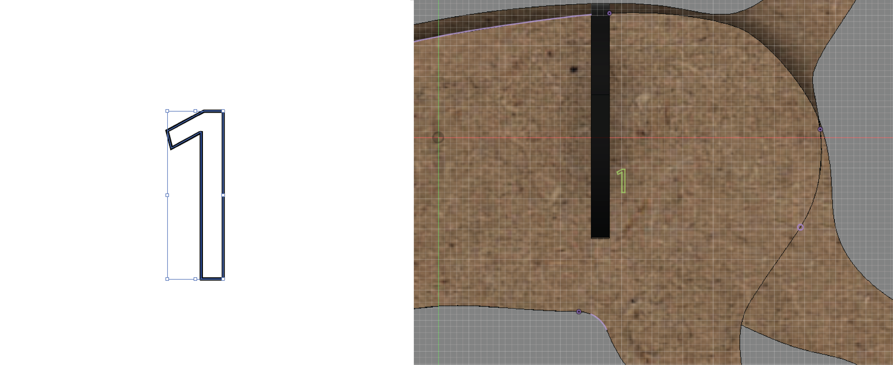
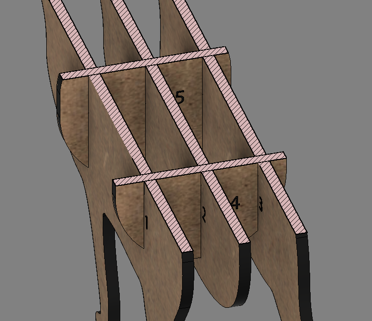
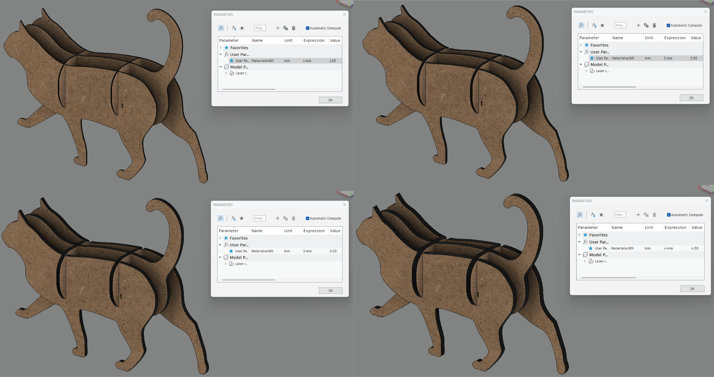
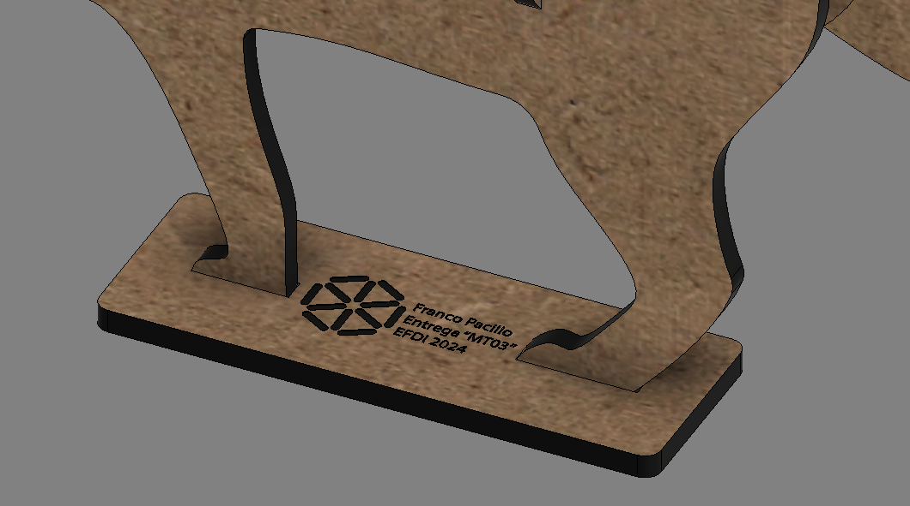
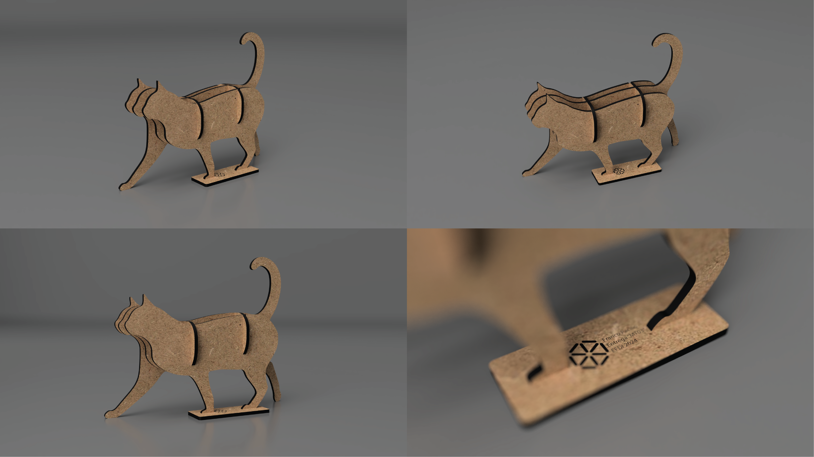
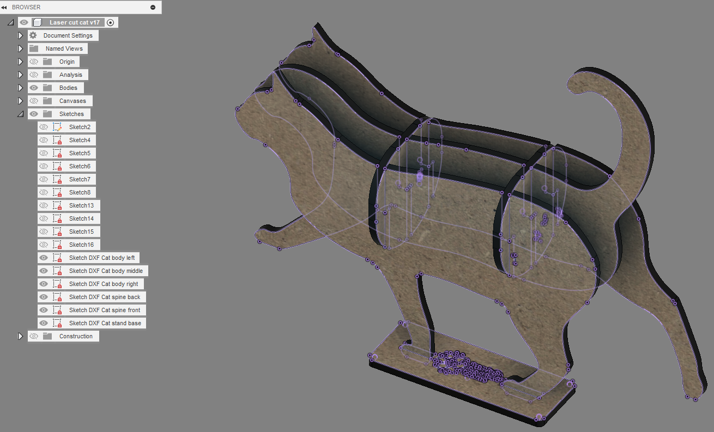
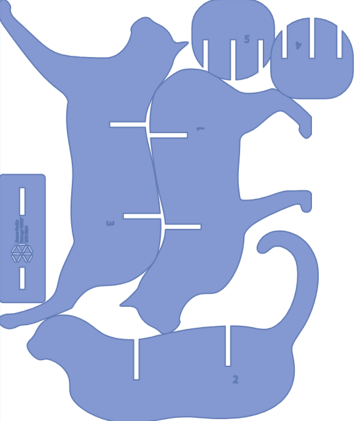
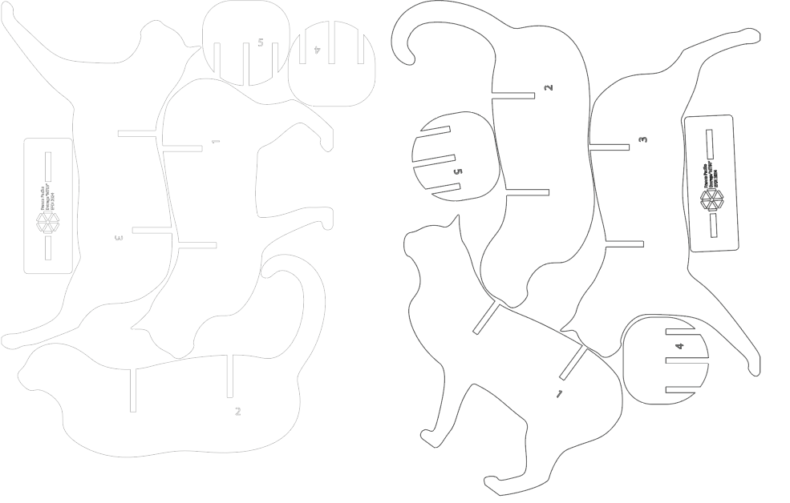
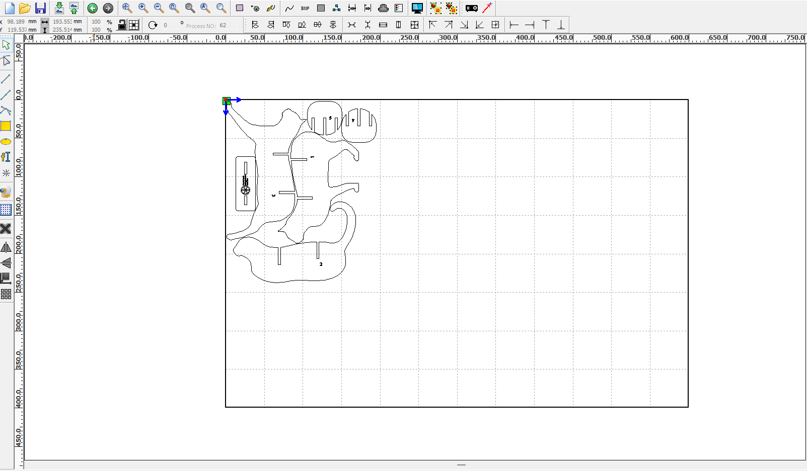
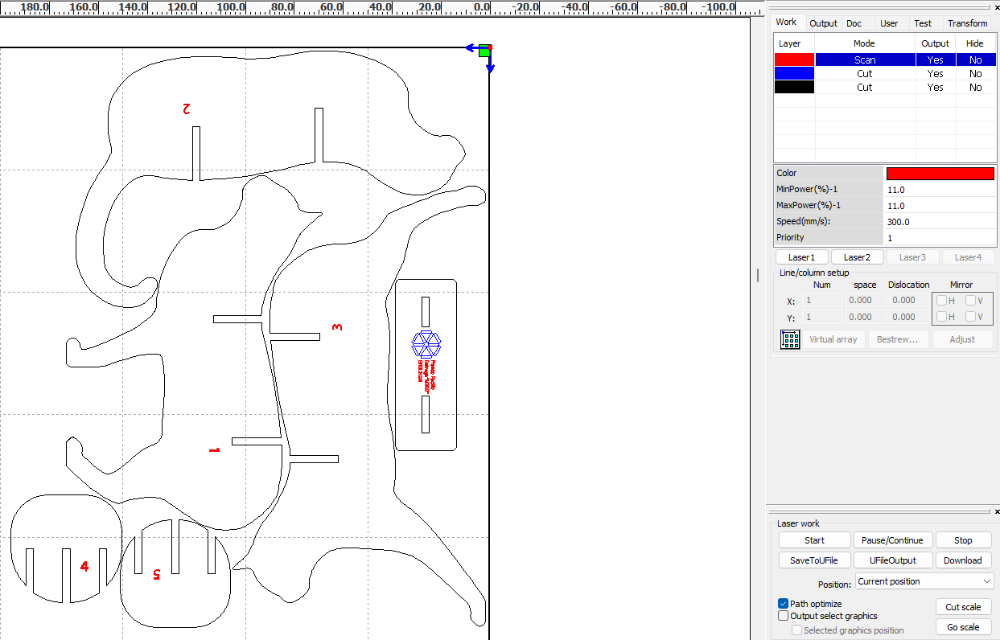

---
hide:
    - toc
---

# MT03

La consigna del MT03 consiste en que cada alumno diseño un objeto que pueda ser fábricado en una máquina de corte láser CNC. Este objeto debe cumplir con determinados requisitos que ponen a prueba diferentes herramientas y aprendizajes dados a lo largo de esté último Módulo Técnico 03.

Requisitos:
<ul>
<li>El objeto debe estar compuesto de 3 a 5 piezas</li>
<li>Debe ser parametrizable en algún sentido</li>
<li>Las piezas se deben poder ensamblar mediante encastres (sin la necesidad de adhesivos o herrajes)</li>
<li>El objeto debe contener las 3 operaciones básicas de la máquina láser (grabado raster, marcado sobre vector y corte sobre vector)</li>
</ul>
Material a utilizar:
<ul>
<li>Cartón o MDF de 3mm de espesor</li>
</ul>
Fabricación:
<ul>
<li>Todas las piezas deben estar diseñadas y contenidas en un mismo archivo formato .DXF</li>
<li>Cada estudiante posee una placa de 600x450mm para su libre uso</li>
</ul>

Proceso de diseño:

Para mi proyecto, elegí diseñar y fábricar un objeto decorativo. Que parta de una imágen del perfil de un animal y a mediante la repetición de planos y perspectiva obtener una representación tridimensional del mismo.

En este caso, estaré trabajando con la figura animal del gato.

A continuación, usaré el software Fusion 360 para diseñar la composición y asignar valores parametrizables a las expresiones que refieran al espesor del material. Obteniendo un diseño paramétrico que permite adaptar los encastres y forma del objeto a raíz del espesor del material que se quiera utilizar para su fabricación.

Cuerpo principal:

Luego de importar la imágen como "Canvas", generamos un "Sketch" y dibujamos el contorno del animal.

Las principales consideraciones fueron:
<ul>
<li>Generar una línea de piso, así el objeto final se puede mantener de pie</li>
<li>Identificar los diferentes planos y generar desfasajes, separaciones de acuerdo a eso</li>
</ul>

Antes de empezar a extruir y avanzar en el diseño, debemos asignar un valor paramétrico al espesor que estaremos utilizando en futuros pasos del diseño.

Con esto en mente, extruimos los 3 planos principales del cuerpo utilizando el parámetro que asignamos, para luego desfasarlo y generar el cuerpo del objeto.

Columna vertebral:

Ahora que tenemos los 3 planos principales del cuerpo, debemos generar un mínimo de dos vértebras que mediante medios encastres sujetarán el cuerpo y le darán estructura al objeto. Nos aseguramos de utilizar la herraimenta de "Project" y "Link to body" para que exista un vínculo entre el plano y el cuerpo, de manera que si cambiamos los parámetros del espesor de los planos, también se actualice el "Sketch" correspondente.

A partir de esa vértebra, la duplicamos y disponemos acorde a la forma del objeto, tratando de obtener un resultado homogéneo en ambas secciones.

Aplicamos "Appearance" dando texturas de MDF y el quemado del láser a las caras laterales.

Utilizamos Illustrator para generar los números con "Outlines" que luego exportaremos como SVG, para importar a un "Sketch" del Fusion 360 y obtener los contornos de las línas de la manera deseada.

Aplicamos números en cada una de las piezas para facilitar el armado

Como podemos ver en las siguientes imágenes, el diseño se adapta con éxito al modificar los parámetros para diferentes valores de espesor de material.

Incluimos una base para optimizar la estabilidad del producto y también agregarle un rótulo con grabado y marcado.

Resultado producto final:

Generación DXF:

En mi caso personal, la forma que encuentro más cómoda de exportar los archivos 3D de fusion 360 a un DXF, es generando un sketch arriba de la pieza, proyectando el plano y exportando el sketch como DXF. 

Una vez hecho esto, abro los DXF en Illustrator para corroborar que todos los trazos estén unidos y sean continuos. Por lo general algunos trazos no quedan perfectamente unidos entonces hay que asegurarnos de usar la herramienta Join en todos los items.

Luego pasamos a generar la disposición, en mi caso utilicé el sitio web [SVGnest](https://svgnest.com/) que nos mostraron en clase para que mediante AI se me auto-posicionen los archivos y me genere la disposición más óptima.

Por fines exploratorios, me tomé un par de minutos para tratar de generar una disposición propia y compararla con la generada por la página, podemos verla a continuación:

Podemos notar que la realizada por la página tiene una optimización del espacio un poco mayor, por lo que nos apegamos a esa.

Generación archivo de corte RDWorks:

Empezamos por importar el archivo .DXF que generamos anteriormente en Illustrator a RDworks

Luego siguiendo el video tutorial brindado por el cuerpo docente [MT03 - RDWorks V8](https://www.youtube.com/watch?v=UwjH-HMmGuY&t=35s), ajustamos los parámetros del archivo para que se corresponda con los utilizados para la máquina de corte láser de UTEC.

Asignamos colores, tipo de función, potencia y velocidad de corte correspondientemente al resultado deseado y obtenemos el resultado final:

[Link de descarga de entrega MT03](https://drive.google.com/file/d/1jG8JYd71SrZ12EiY_zZvsviHv8tTaDqO/view?usp=sharing)

Conclusiones y reflexiones:

Desde mi punto de vista personal, la actividad MT03 me resultó muy positiva ya que pude aprender mediante la práctica las herramientas de parametrización de fusion 360 y lo que conlleva generar un diseño parámetrico, en estos casos el diseñador debe prestar especial atención a en qué momentos asignar un valor paramétrico y qué consideraciones tener en el diseño para que al modificar estos valores no se "rompa" el objeto. Ese fue el mayor desafío para mí ya que nunca había trabajado con estas herramientas anteriormente.

Por otro lado, la sección de armado de DXF y disposición de las piezas me resultó positivo la puesta en práctica de nuevas herramientas como la página SVGnest que no la había utilizado previamente y me resulta una herramienta positiva para optimizar tanto tiempos a la hora de generar la composición, como recursos a la hora de hacer el corte gracias al ahorro de material logrado.

Por último, el apartado de generar el archivo de corte en RDWorks, asignar distintos colores a los distintos vectores del diseño, para luego configurar los valores en base a la función que se quiera realizar, es igual de importante que todo lo anterior. Así podemos realmente tener un pantallazo del mundo real cuándo se trata de generar un gcode que será utilizado con éxito por una máquina de corte láser. Y no es solamente enviar un PDF a una casa de cortes.

En conclusión, considero que la actividad MT03 nos da herramientas tanto para optimizar nuestros esfuerzos a la hora de generar un diseño, así como los conocimientos y técnicas para poder traer a la realidad un producto diseñado para ser cortado láser.

¡Muchas gracias!

<meta charset="UTF-8">
    <meta name="viewport" content="width=device-width, initial-scale=1.0">
    <title>Texto Arcoíris</title>
    