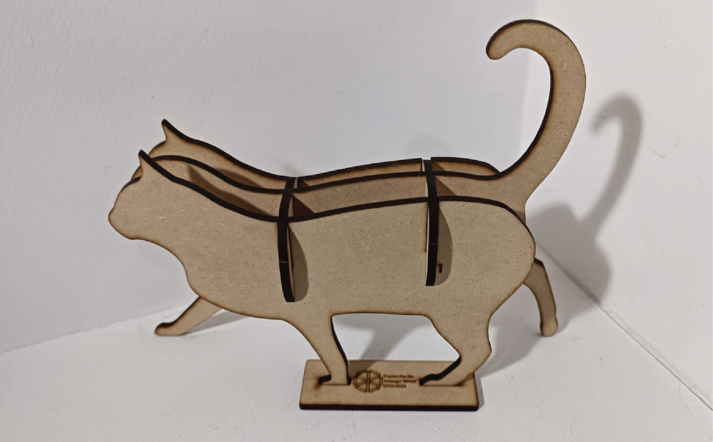

---
hide:
    - toc
---

# MT03

La consigna del MT03 consiste en que cada alumno diseñe un objeto que pueda ser fabricado en una máquina de corte láser CNC. Este objeto debe cumplir con determinados requisitos que ponen a prueba diferentes herramientas y aprendizajes adquiridos a lo largo de este último Módulo Técnico 03.

Requisitos:
<ul>
<li>El objeto debe estar compuesto de 3 a 5 piezas</li>
<li>Debe ser parametrizable en algún sentido</li>
<li>Las piezas se deben poder ensamblar mediante encastres (sin la necesidad de adhesivos o herrajes)</li>
<li>El objeto debe contener las 3 operaciones básicas de la máquina láser (grabado raster, marcado sobre vector y corte sobre vector)</li>
</ul>
Material a utilizar:
<ul>
<li>Cartón o MDF de 3mm de espesor</li>
</ul>
Fabricación:
<ul>
<li>Todas las piezas deben estar diseñadas y contenidas en un mismo archivo formato .DXF</li>
<li>Cada estudiante posee una placa de 600x450mm para su libre uso</li>
</ul>

Proceso de diseño:

Para mi proyecto, elegí diseñar y fabricar un objeto decorativo que parte de una imagen del perfil de un animal. Mediante la repetición de planos y el uso de la perspectiva, obtendré una representación tridimensional del mismo.

En este caso, estaré trabajando con la figura animal del gato.

A continuación, usaré el software Fusion 360 para diseñar la composición y asignar valores parametrizables a las expresiones que se refieren al espesor del material. Esto permitirá obtener un diseño paramétrico que posibilite adaptar los encastres y la forma del objeto en función del espesor del material que se utilice para su fabricación.

Cuerpo principal:

Luego de importar la imágen como "Canvas", generamos un "Sketch" y dibujamos el contorno del animal.

Las principales consideraciones fueron:
<ul>
<li>Generar una línea de piso, así el objeto final se puede mantener de pie</li>
<li>Identificar los diferentes planos y generar desfasajes, separaciones de acuerdo a eso</li>
</ul>

Antes de empezar a extruir y avanzar en el diseño, debemos asignar un valor paramétrico al espesor que estaremos utilizando en futuros pasos del diseño.

Con esto en mente, extruimos los 3 planos principales del cuerpo utilizando el parámetro que asignamos, para luego desfasarlo y generar el cuerpo del objeto.

Columna vertebral:

Ahora que tenemos los tres planos principales del cuerpo, debemos generar un mínimo de dos vértebras que, mediante encastres, sujetarán el cuerpo y le darán estructura al objeto. Nos aseguraremos de utilizar las herramientas "Project" y "Link to body" para que exista un vínculo entre el plano y el cuerpo, de manera que, si cambiamos los parámetros del espesor de los planos, también se actualice el "Sketch" correspondiente.

A partir de esa vértebra, la duplicamos y disponemos acorde a la forma del objeto, tratando de obtener un resultado homogéneo en ambas secciones.

Aplicamos "Appearance" dando la textura del MDF a las caras planas y el quemado del láser a las caras laterales.

Utilizamos Illustrator para generar los números con "Outlines" que luego exportaremos como SVG. Posteriormente, importaremos estos archivos SVG en un "Sketch" de Fusion 360 para obtener los contornos de las líneas de la manera deseada.

Aplicamos números en cada una de las piezas para facilitar el armado y poner en práctica funciones del corte láser.

Como podemos ver en las siguientes imágenes, el diseño se adapta con éxito al modificar los parámetros para diferentes valores de espesor de material.

Incluimos una base para optimizar la estabilidad del producto y también agregarle un rótulo con grabado y marcado.

Resultado producto final:

Generación DXF:

En mi caso personal, la forma que encuentro más cómoda de exportar los archivos 3D de Fusion 360 a un DXF es generando un sketch sobre la pieza, proyectando el plano y exportando el sketch como DXF.

Una vez hecho esto, abro los archivos DXF en Illustrator para corroborar que todos los trazos estén unidos y sean continuos. Por lo general, algunos trazos no quedan perfectamente unidos, por lo que hay que asegurarnos de usar la herramienta Join en todos los ítems.

Luego, pasamos a generar la disposición. En mi caso, utilicé el sitio web [SVGnest](https://svgnest.com/) que nos mostraron en clase, el cual utiliza inteligencia artificial para auto-posicionar los archivos y generar la disposición más óptima.

Por fines exploratorios, me tomé un par de minutos para intentar generar una disposición propia y compararla con la generada por la página. Podemos verla a continuación:

Podemos notar que la realizada por la página tiene una optimización del espacio un poco mayor, por lo que nos apegamos a esa.

Generación archivo de corte RDWorks:

Empezamos por importar el archivo .DXF que generamos anteriormente en Illustrator a RDworks.

Luego, siguiendo el video tutorial proporcionado por el cuerpo docente titulado [MT03 - RDWorks V8](https://www.youtube.com/watch?v=UwjH-HMmGuY&t=35s), ajustamos los parámetros del archivo para que se correspondan con los utilizados para la máquina de corte láser de UTEC.

Asignamos colores, tipo de función, potencia y velocidad de corte correspondientemente al resultado deseado y obtenemos el resultado final:

[Link de descarga de entrega MT03](https://drive.google.com/file/d/1jG8JYd71SrZ12EiY_zZvsviHv8tTaDqO/view?usp=sharing)

Conclusiones y reflexiones:

Desde mi perspectiva, la actividad MT03 resultó sumamente enriquecedora, ya que me permitió aprender de manera práctica el uso de las herramientas de parametrización en Fusion 360 y entender la complejidad que implica la creación de diseños paramétricos. En este proceso, tuve que prestar especial atención a cuándo asignar valores paramétricos y considerar cómo estos afectarían al diseño para evitar que el objeto se vuelva disfuncional al realizar modificaciones. Este desafío fue particularmente interesante para mí, dado que no tenía experiencia previa con estas herramientas.

Además, la sección dedicada al armado de archivos DXF y la disposición de las piezas fue sumamente enriquecedora. La introducción de herramientas nuevas como SVGnest, que no había utilizado previamente, resultó muy positiva. Esta herramienta no solo optimizó los tiempos necesarios para generar la composición, sino que también contribuyó al ahorro de material durante el corte, lo cual es fundamental en cualquier proyecto de fabricación.

Por último, la fase de generar el archivo de corte en RDWorks, asignar colores a los vectores del diseño y configurar los valores según la función deseada fue igualmente importante. Esta etapa nos brindó una visión más realista del proceso de fabricación, permitiéndonos comprender cómo se traducen nuestros diseños en instrucciones específicas para la máquina de corte láser. No se trata simplemente de enviar un archivo PDF a una casa de cortes, sino de comprender los detalles técnicos necesarios para una producción exitosa.

En resumen, considero que la actividad MT03 nos ha dotado de herramientas esenciales tanto para optimizar nuestros esfuerzos en el diseño como para adquirir los conocimientos y técnicas necesarios para llevar a cabo la fabricación de productos diseñados para ser cortados con láser.

¡Muchas gracias!

Actualización luego de visita a Laboratorio de Innovación abierta de Durazno:

Como parte del MT03, se nos orientó a elegir uno de los Laboratorios de Fabricación e Innovación abierta que la UTEC dispone para sus estudiantes. Personalmente elegí el del departamento de Durazno ya que es el más cercano a Montevideo, la ciudad dónde vivo.

El laboratorio de Durazno cuenta con diversos equipamientos; Impresoras 3D SLA, SLS y FDM, Cortadora Láser, Router de Fresado CNC y varias herramientas de uso manual. En esta instancia, vamos a utilizar la máquina de Corte Láser.

El primer corte dejó en evidencia un claro error en el diseño. Ya que la pieza central del gato no tiene patas, no se sostiene y se cae al piso. En ese momento me puse manos a la obra y corregí el diseño 3D, para posteriormente exportar y generar un nuevo archivo de corte con esos detalles corregidos. 

Por otro lado, noté que el grabado lineal que apliqué sobre el logo de la UTEC quedó con algunas ondulaciones. 

Al conversar con los docentes referentes, llegamos a la conclusión de que había establecido un parámetro de velocidad de corte demasiado bajo para la escala del dibujo. Entonces aproveché el tiempo que aún nos quedaba y generé un archivo de corte con 4 diferentes velocidades para poner a prueba esa teoría.

Como se puede ver en la imágen, la velocidad de 20mm/s si bien como efecto colateral fue la que más "quemó" el material, también fue la que resultó en un trazo recto y preciso.

Más allá de que el diseño era de relativamente baja complejidad, me quedé muy satisfecho con el resultado, la prolijidad de los encastres, las curvaturas y la exploración final para obtener detalles más precisos.

<meta charset="UTF-8">
    <meta name="viewport" content="width=device-width, initial-scale=1.0">
    <title>Texto Arcoíris</title>
    