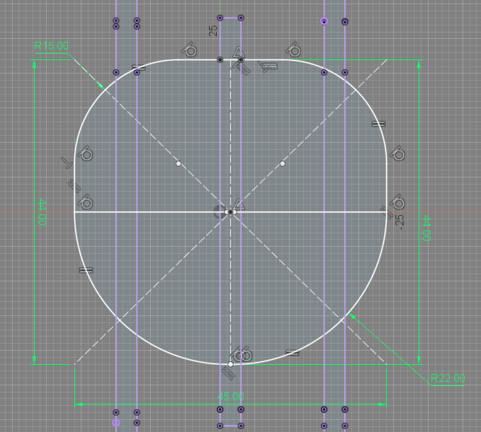

---
hide:
    - toc
---

# MT03

La consigna del MT03 consiste en que cada alumno diseño un objeto que pueda ser fábricado en una máquina de corte láser CNC. Este objeto debe cumplir con determinados requisitos que ponen a prueba diferentes herramientas y aprendizajes dados a lo largo de esté último Módulo Técnico 03.

Requisitos:
<ul>
<li>El objeto debe estar compuesto de 3 a 5 piezas</li>
<li>Debe ser parametrizable en algún sentido</li>
<li>Las piezas se deben poder ensamblar mediante encastres (sin la necesidad de adhesivos o herrajes)</li>
<li>El objeto debe contener las 3 operaciones básicas de la máquina láser (grabado raster, marcado sobre vector y corte sobre vector)</li>
</ul>
Material a utilizar:
<ul>
<li>Cartón o MDF de 3mm de espesor</li>
</ul>
Fabricación:
<ul>
<li>Todas las piezas deben estar diseñadas y contenidas en un mismo archivo formato .DXF</li>
<li>Cada estudiante posee una placa de 600x450mm para su libre uso</li>
</ul>

Proceso de diseño:

Para mi proyecto, elegí diseñar y fábricar un objeto decorativo. Que parta de una imágen del perfil de un animal y a mediante la repetición de planos y perspectiva obtener una representación tridimensional del mismo.

En este caso, estaré trabajando con la figura animal del gato.

A continuación, usaré el software Fusion 360 para diseñar la composición y asignar valores parametrizables a las expresiones que refieran al espesor del material. Obteniendo un diseño paramétrico que permite adaptar los encastres y forma del objeto a raíz del espesor del material que se quiera utilizar para su fabricación.

Cuerpo principal:

Luego de importar la imágen como "Canvas", generamos un "Sketch" y dibujamos el contorno del animal.

Las principales consideraciones fueron:
<ul>
<li>Generar una línea de piso, así el objeto final se puede mantener de pie</li>
<li>Identificar los diferentes planos y generar desfasajes, separaciones de acuerdo a eso</li>
</ul>

Antes de empezar a extruir y avanzar en el diseño, debemos asignar un valor paramétrico al espesor que estaremos utilizando en futuros pasos del diseño.

Con esto en mente, extruimos los 3 planos principales del cuerpo utilizando el parámetro que asignamos, para luego desfasarlo y generar el cuerpo del objeto.

Columna vertebral:

Ahora que tenemos los 3 planos principales del cuerpo, debemos generar un mínimo de dos vértebras que mediante medios encastres sujetarán el cuerpo y le darán estructura al objeto. Nos aseguramos de utilizar la herraimenta de "Project" y "Link to body" para que exista un vínculo entre el plano y el cuerpo, de manera que si cambiamos los parámetros del espesor de los planos, también se actualice el "Sketch" correspondente.

A partir de esa vértebra, la duplicamos y disponemos acorde a la forma del objeto, tratando de obtener un resultado homogéneo en ambas secciones.

