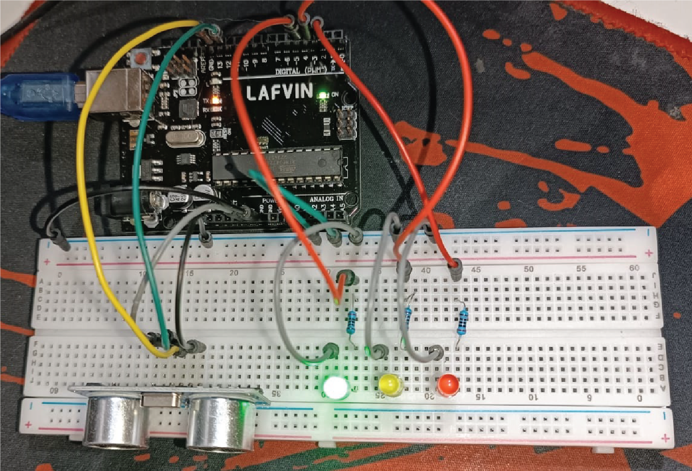
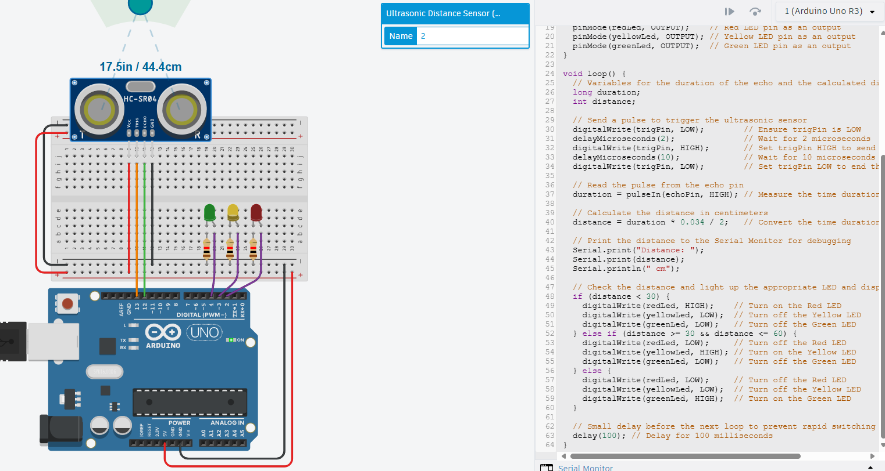
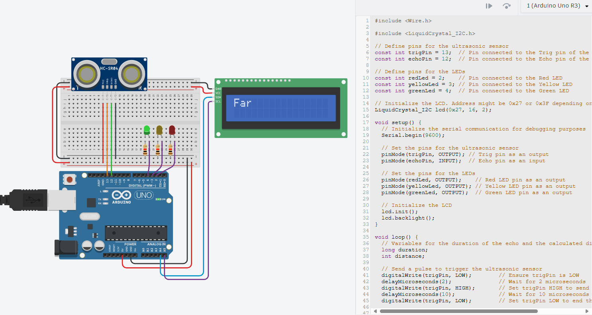

---
hide:
    - toc
---

# MT04

El módulo MT04 se enfoca en brindarle a los estudiantes las herramientas necesarias para programar utilizando placas y circuitos electrónicos basados en Arduino UNO y el lenguaje de programación Arduino IDE (similar a C++).

Modelo de aprendizaje personal

Basé mis métodos de aprendizaje y desarrollo a través de la información brindada por la especialización, complementada por videos tutoriales de YouTube, Chat GPT, foros de Arduino, experimentación en TinkerCad Circuits y exploración con el Starter Kit Arduino UNO que UTEC distribuyó a sus estudiantes.

Luz LED

Mi primer exploración fue realizar un circuito y código básico que me permita encender una luz LED utilizando la placa Arduino UNO y Protoboard. También experimenté utilizando un pulsador para accionar/desactivar el circuito.

[Link a set-up y código en TinkerCAD](https://www.tinkercad.com/things/gZEuhQArGw9-spectacular-turing?sharecode=SvkwHGN5WtFL1Xj87NJCTQzAmJjn4fc816eWJsz8iQM)

En TinkerCAD subí una versión actualizada de la LED con un código sencillo que la hace parpadear cada segundo.

Semáforo con 3 LED

A partir de ese primer acercamiento, quise realizar algo con luces led que cumpla cierto tipo de función y se acerque a algo real. Por eso decidí generar un circuito en el que tres luces LED siguen un patrón de luces y tiempos similar a un semáforo.

[Link a set-up y código en TinkerCAD](https://www.tinkercad.com/things/bPdXTtsl0KS-magnificent-turing)

Sensor de proximidad con 3 LED

El INPUT que decidí utlizar, es el sensor de distancia de ultrasonido, que acompañado por tres luces LED, genera códigos de luz en base a la distancia que se encuentra el objeto del sensor.

[Link a set-up y código en TinkerCAD](https://www.tinkercad.com/things/1uI3eAzWSAN-sensor-de-proximidad-con-3-leds?sharecode=geCeWUwjOGe2UBp9Y-uY0c-meey0yNGMhs2RDvr6Nq0)

Sensor de proximidad con 3 LED y pantalla 16x2

Para agregar más desafío y complejidad, agregué la pantalla 16x2 que acompaña el circuito anterior pero reflejando en texto la posición del objeto relativa al sensor.

[Link a set-up y código en TinkerCAD](https://www.tinkercad.com/things/llhSwRI1rL4-sensor-de-proximidad-con-3-led-y-pantalla-16x2?sharecode=LvzrCmqijtahM6SPgpyxeBuTeJfCat9IvG0dNTnr6Xo)

Conclusiones y reflexiones

¡Muchas gracias por su atención!

<meta charset="UTF-8">
    <meta name="viewport" content="width=device-width, initial-scale=1.0">
    <title>Texto Arcoíris</title>
    