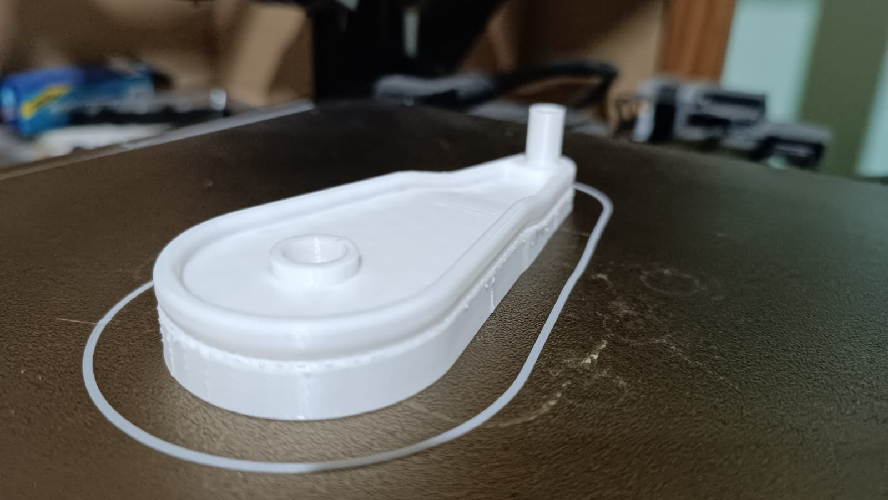

---
hide:
    - toc
---

# MT05

Para este módulo, trabajaremos con un archivo 3D proporcionado por el cuerpo docente. Este archivo deberá abrirse en Fusion 360, y luego exportarse como .STL. Posteriormente, importaremos el archivo al software IdeaMaker, configurado para la impresora de los laboratorios de UTEC, para generar un archivo .GCODE con parámetros preestablecidos para la tarea.

Como bonus, se nos plantea realizar un escaneo 3D de una pieza utilizando fotogrametría para su posterior fabricación.

En mi caso, al poseer una impresora 3D y un escáner 3D personal, imprimiré el archivo .STL con mi propia impresora y posteriormente escanearé la pieza para comparar los resultados del modelo original con el escaneado.

Paso 1 - Importación y exportación en Fusion 360:

 
Primero importamos el archivo .F3D a Fusion 360

 
Luego seleccionamos el objeto 3D para exportarlo como .STL

 
Utilizamos parámetros estándar para su exportación

Paso 2 - Generación de archivo .Gcode:

 
Importamos el archivo .STL al software IdeaMaker previamente configurado para su uso con la impresora Raise3D Pro2 Plus y establecemos los parámetros preestablecidos para la tarea.

 
Generamos el corte y previsualizamos la impresión, asegurándonos que todos los parámetros se corresponden con la previsualización.

(Opcional) Paso 3 - Impresión 3D en impresora personal:

 
Importamos el archivo .STL al software Ultimaker Cura previamente configurado para su uso con la impresora Creality Ender 3 S1 Pro y utilizamos parámetros similares a los preestablecidos para la tarea, con algunas modificaciones personales.

 
Accionamos la impresión.

 
Impresión 3D finalizada.

(Opcional) Paso 4 - Escaneo 3D de la pieza impresa:

 
Disponemos la pieza impresa centrada en la dual-axis turn-table del scanner Revopoint Mini 2.

 
Realizamos un mínimo de 3 escaneos con diferentes disposiciones de la pieza para captar todos sus ángulos.

 
Generamos la unión de los 3 escaneos y obtenemos el resultado final, que posteriormente podemos utilizar para realizar ingeniería inversa en programas de modelado 3D.

Conclusiones y reflexiones:

Considero que, en la actualidad, las herramientas de fabricación digital, como la impresión 3D y el escaneo 3D, son fundamentales en el diseño de productos. Estas tecnologías permiten crear prototipos y modelos finales con formas y mecanismos complejos, facilitando la personalización y optimización de los diseños.

Además, reducen el tiempo y los costos de desarrollo, eliminando la necesidad de moldes costosos y largos tiempos de espera, y minimizan el desperdicio de materiales, promoviendo prácticas de producción más ecológicas.

En resumen, la integración de estas herramientas en el proceso de diseño y fabricación impulsa la innovación, transformando la manera en que concebimos y producimos bienes con mayor flexibilidad, eficiencia y creatividad.

[Link de descarga de la entrega MT05](https://drive.google.com/file/d/182S4ZmkxVGvPr-QpiXp1kFIvlmd8Sz4P/view?usp=drive_link)

¡Muchas gracias por su atención!

<meta charset="UTF-8">
    <meta name="viewport" content="width=device-width, initial-scale=1.0">
    <title>Texto Arcoíris</title>
    