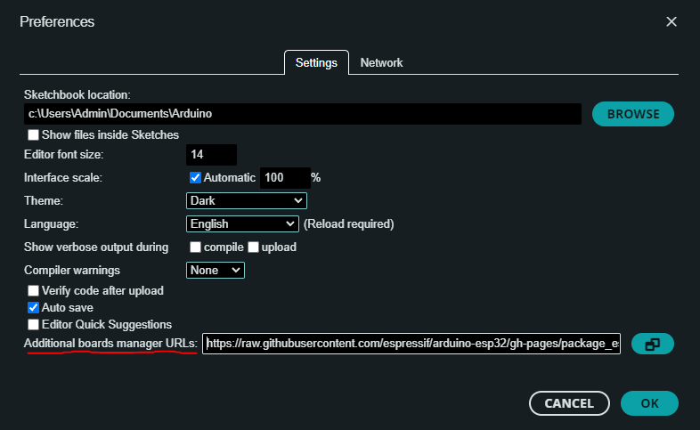
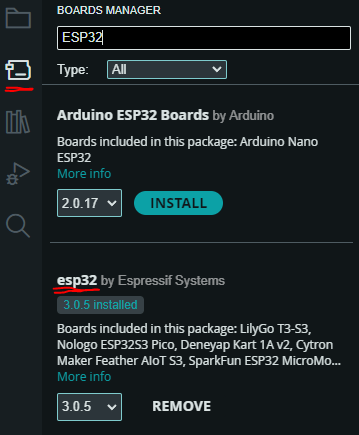
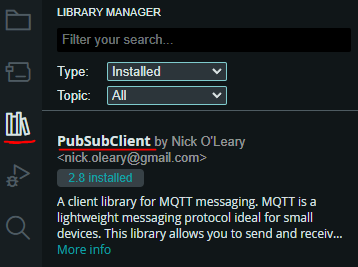
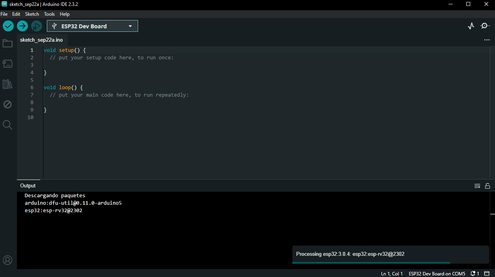
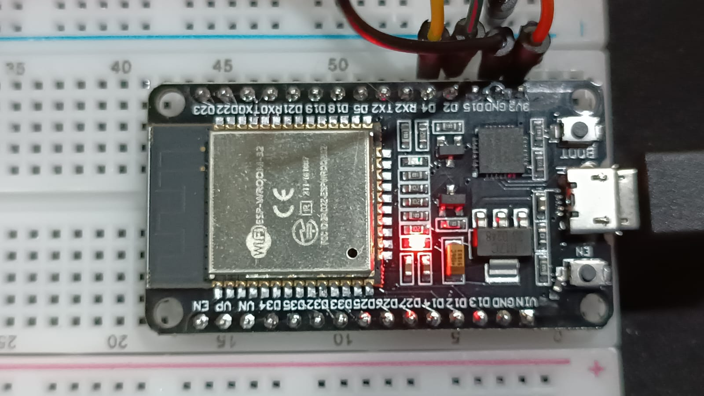
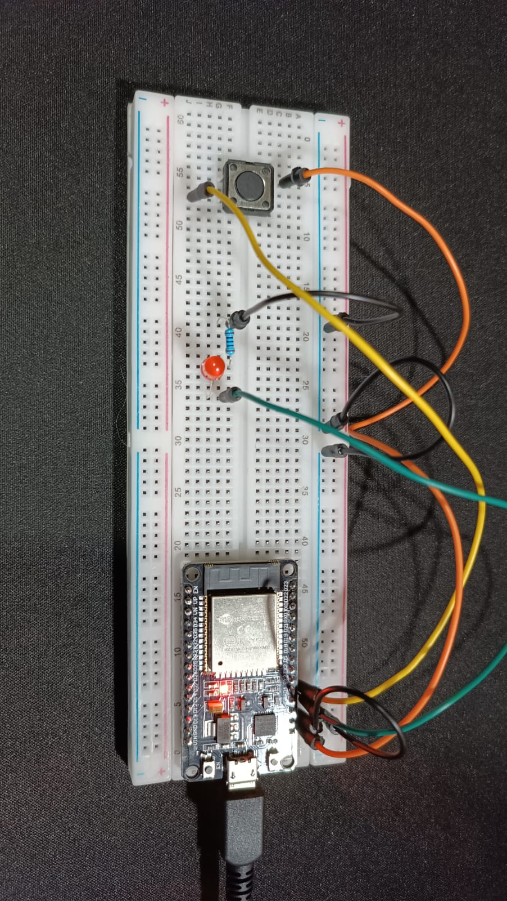
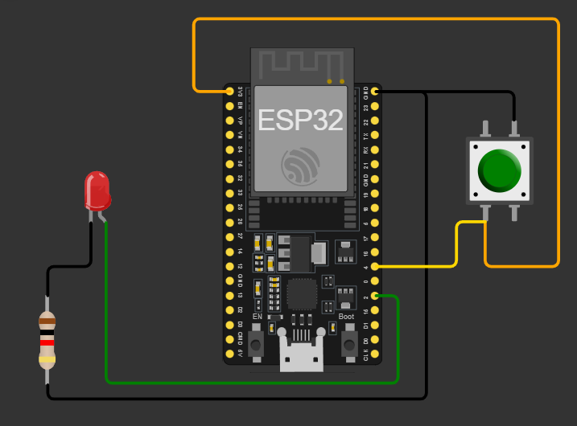
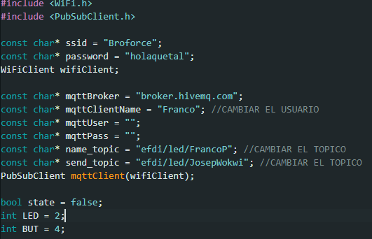
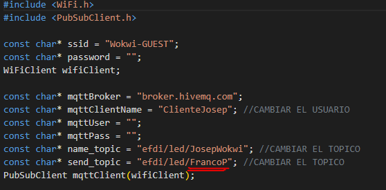
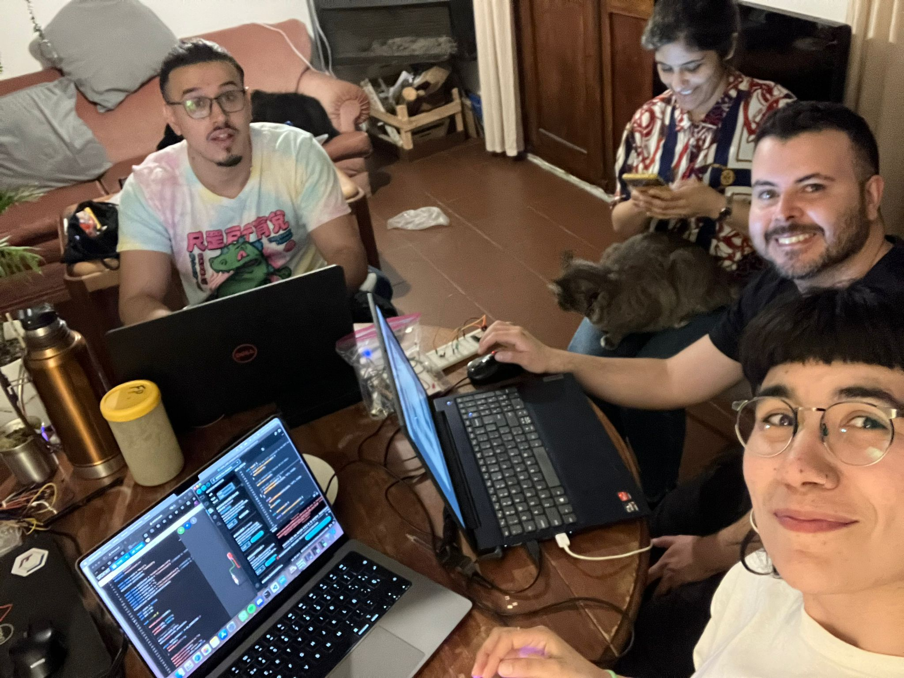

---
hide:
    - toc
---

# MT07

Networking

Para este módulo, trabajaremos con un microcontrolador electrónico ESP32 el cual mediante el broker MQTT "HiveMQ" y la plataforma web "Wokwi", configuraremos un código que permita enviar una señal a nuestro circuito desde la web.

Pre-configuración

Para realizar este ejercicio, debemos asegurarnos de instalar correctamente las librerías y configuraciones necesarias para poder hacer el upload del código desde el software Arduino IDE hacia nuestro microcontrolador, utilizando una conexión USB a Micro USB.

Ingresamos el link de librería ESP32 a las preferencias de Arduino IDE: 

https://raw.githubusercontent.com/espressif/arduino-esp32/gh-pages/package_esp32_index.json

Nos aseguramos de que esté actualizado a su última versión: 

Instalamos la librería PubSubClient by Nick: 

En cada uno de estos pasos, Arduino IDE va a instalar y compilar los datos en su almacenamiento local del ordenador: 

Por último, seleccionamos el puerto COM correspondiente al puerto dónde el microcontrolador está conectado mediante Micro USB a USB en nuestro ordenador y seleccionamos a placa "ESP32 Dev Module", para utilizar con nuestro modelo ESP-WROOM-32. 

Microcontrolador utilizado: 

Circuito Electrónico

Primero debemos configurar el circuito electrónico utilizando el microcontrolador ESP32, breadboard, cables, lámpara LED, resistencia y botón pulsador. 

El circuito utilizado es el siguiente: 

Código cargado al Microcontrolador

Utilizamos como nombre de cliente "Franco", luego como name_topic "FrancoP" lo cual nombra a nuestra placa y el send_topic como "JosepWokwi" el cual utilizaremos con nuestros compañeros de EFDI en Montevideo. 

[Link de descarga a archivo de Arduino IDE para ver código entero cargado a microcontrolador](https://drive.google.com/file/d/1uTNCHmP4ZATRWRvQ2qZ94FSTwB6GkpvG/view?usp=sharing)

Código cargado a Wokwi

Dentro de la plataforma Wokwi, nos aseguramos de colocar en "send_topic" el nombre de la placa a la que se quiere enviar información y el "name_topic" "JosepWokwi" para correspondernos con lo establecido en Arduino IDE. Los criterios se invierten. 

Prueba del funcionamiento

Comparto un video del funcionamiento de la placa acompañado por el Wokwi que se utilizó para esta interacción

[Video del funcionamiento](https://drive.google.com/file/d/1egZ740gZcss9--FlMexKdxuXNPjfTbSe/view?usp=sharing)

[Link a servidor Wokwi dónde podemos comunicarnos a mi placa](https://wokwi.com/projects/409765401227302913)

Conclusiones y reflexiones

Este ejercicio, sin duda fue un desafío. Se manejaron terminologías y aplicaciones que desconocía totalmente, entonces la curva de aprendizaje fue conflictuosa. Pero luego de horas de dedicación, y darnos la cabeza contra la pared. Logramos hacer funcionar nuestras placas y que podamos comunicarnos con ellas y entre ellas desde Wokwi. 

e llevo una linda experiencia en equipo dónde 4 personas que poco saben programar, se ayudan para lograr cumplir un objetivo común. 

[Link de Wokwi señal a placa de Pablo Castro](https://wokwi.com/projects/409774412085905409) 
[Link de Wokwi señal a placa de Edgardo Sarancho](https://wokwi.com/projects/409766793719510017)

¡Muchas gracias por su atención!

<meta charset="UTF-8">
    <meta name="viewport" content="width=device-width, initial-scale=1.0">
    <title>Texto Arcoíris</title>
    