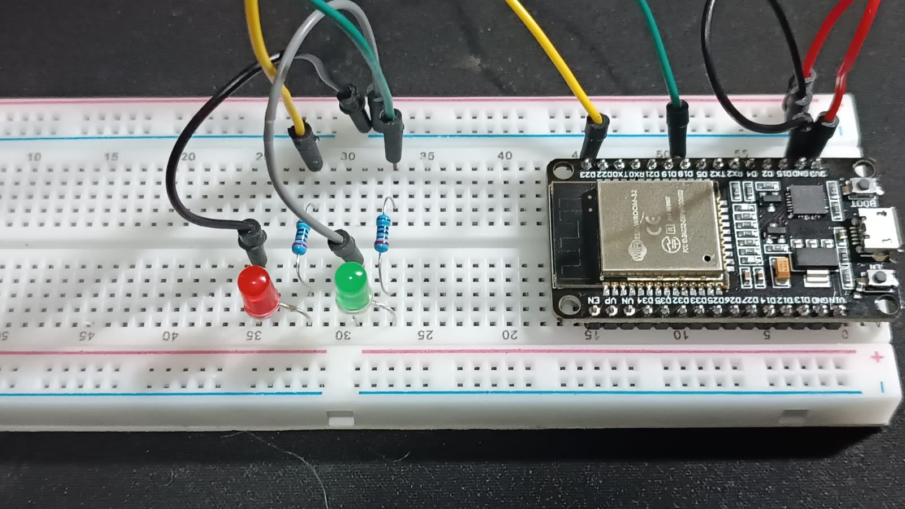
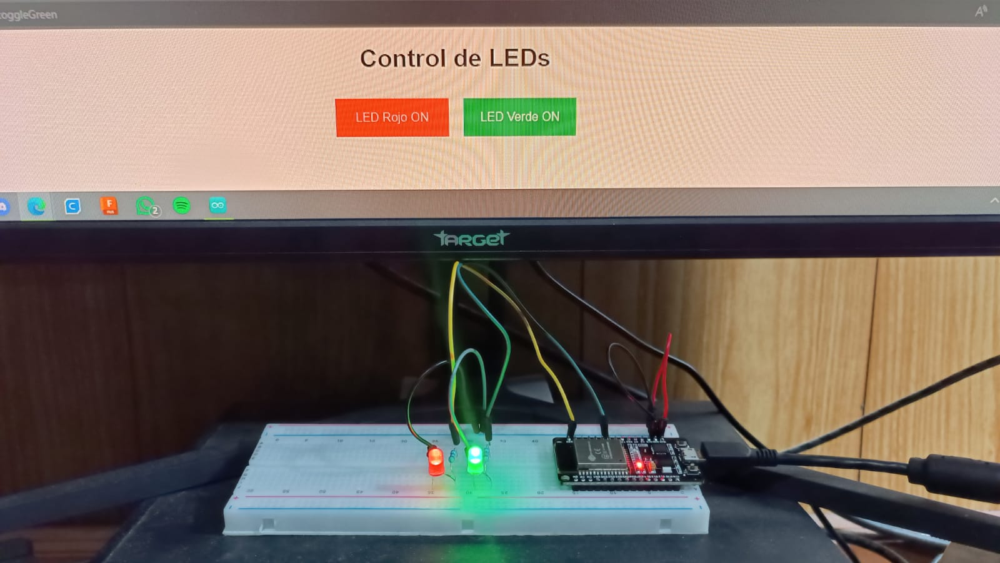
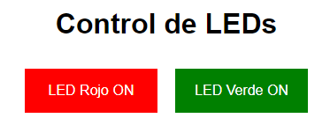
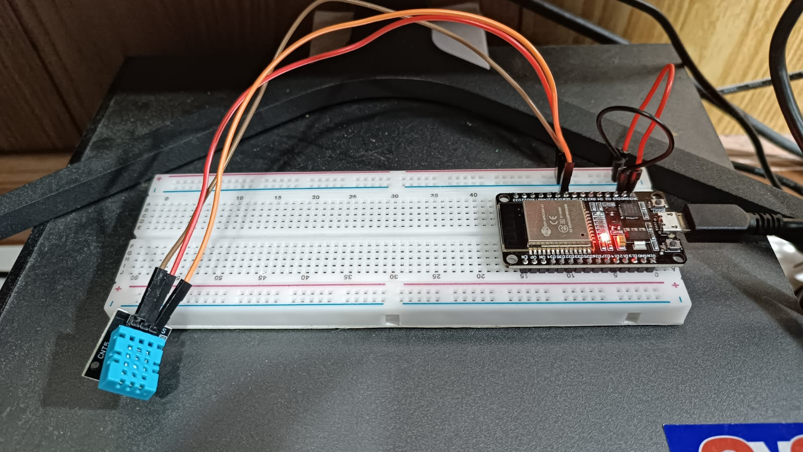
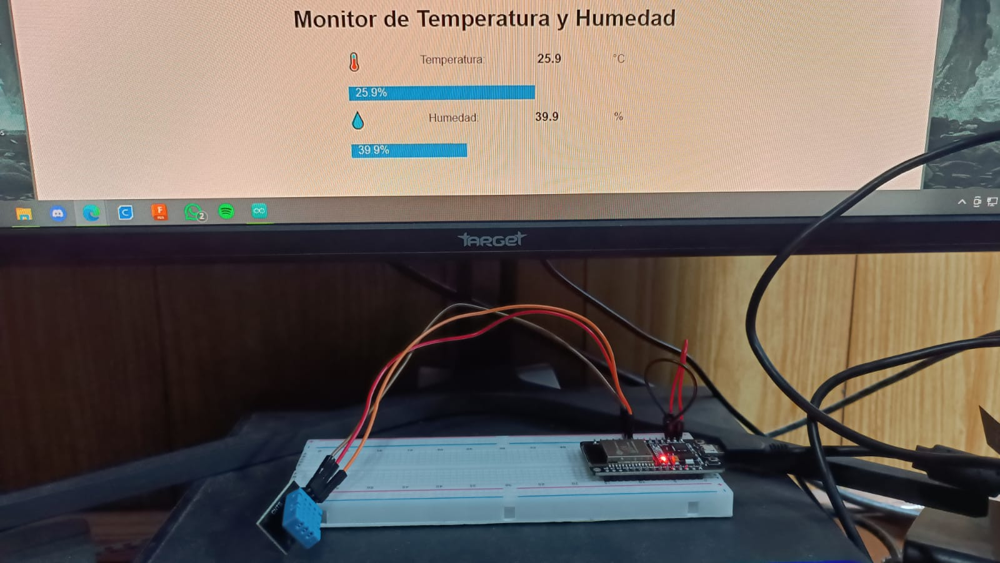
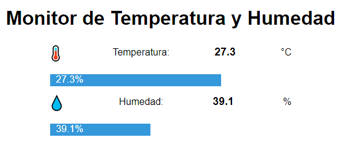

---
hide:
    - toc
---

# MT07

Interficies y aplicaciones

Para este Módulo 07 me propuse experimentar con accionamiento remoto de luces led y con registro remoto de datos de temperatura y humedad.

Control de luces

En un principio, generé un circuito de luces led verde y roja, con una placa ESP32. De manera que pueda desde un dispositivo remoto, controlar el accionamiento de cada una de estas luces, acompañado por un interfaz gráfico web.

Componentes:

Protoboard 
Controlador ESP32 
Cables 
Resistencias 
Luz LED Roja 
Luz LED Verde 

Mi código lo generé utilizando un input de Chat GPT:

Genera un código para Arduino IDE que utilice una placa ESP32, un LED rojo conectado al pin 23 y un LED verde conectado al pin 18. Este código debe permitir conectarse a una red Wi-Fi generada por la placa, acceder a la dirección IP y abrir una interfaz web que contenga dos botones: uno rojo para controlar el LED rojo y otro verde para controlar el LED verde. Los botones deben permitir encender y apagar cada LED respectivamente. Además, los colores de los bloques de texto en la interfaz deben identificarse gráficamente según el estado del LED (encendido = iluminado, apagado = no iluminado).

El resultado fue el siguiente:

Interfaz gráfico:

Arduino IDE:

Fue necesario incluir las bibliotecas correspondientes a la tarjeta ESP32 y su control WiFi y de servidor Web; "WiFi.h" y "WebServer.h".

[Descargar código](https://drive.google.com/drive/folders/1sVFwwyeKROdjmZI8Y29AMfRJg8tF652e?usp=sharing)

Sensor de temperatura y humedad

Para este experimento, generé un circuito más sencillo, ya que mi objetivo es solamente poder medir esos valores a tiempo real y que se diagramen en una interfaz digital web.

Componentes:

Sensor de temperatura y humedad DHT11 
Placa ESP32 
Protoboard 
Cables 

Mi código lo generé utilizando un input de Chat GPT:

Genera un código para Arduino IDE que utilice un sensor de temperatura y humedad DHT11 conectado al pin D18 de una placa ESP32. Este código debe permitir conectarse a una red Wi-Fi generada por la placa, acceder a la dirección IP y abrir una interfaz web con indicadores en tiempo real de temperatura y humedad. La interfaz debe incluir barras gráficas que representen los valores, mostrar los valores numéricos en % (humedad) y °C (temperatura), y agregar íconos representativos para cada ítem (temperatura y humedad) al lado de sus indicadores.

El resultado fue el siguiente:

Interfaz gráfico:

Arduino IDE:

Fue necesario incluir la biblioteca "DHT.h" para poder utilizar el sensor de temperatura y humedad, al igual que las mismas bibliotecas "WiFi.h" y "WebServer.h" como en el experimento anterior.

[Descargar código](https://drive.google.com/drive/folders/12vhpkKBYXDuB0vV58A4Q_0Lp6zvbIg3f?usp=sharing)

¡Muchas gracias por su atención!

<meta charset="UTF-8">
    <meta name="viewport" content="width=device-width, initial-scale=1.0">
    <title>Texto Arcoíris</title>
    