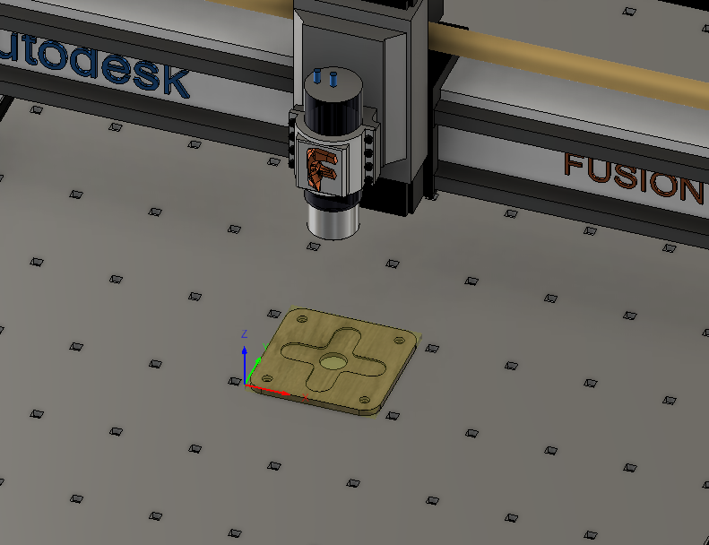

---
hide:
    - toc
---

# MT08

Control numérico computadorizado (CNC)

Para este módulo, trabajaremos con un archivo 3D proporcionado por el cuerpo docente. Este archivo deberá abrirse en Fusion 360, y luego de configurado correctamente, poder exportarse como un .gcode compatible con una máquina de fresado CNC de 3 ejes.

Pre-configuración

Posteriormente a importar el archivo 3D brindado por el cuerpo docente, debemos configurar en el apartado de "Fabricación" una máquina genérica de 3 ejes, la cual es compatible con la "X-Carve", el router de fresado CNC que la UTEC cuenta.

Nos aseguramos que el modelo 3D de referecia está correctamente posicionado en función a los ejes de la máquina virtualizada, eso lo podemos hacer a partir de la pre-view que nos brinda Fusion 360.

Debemos configurar la fresa, con su determinado diámetro y tipología que estaremos utilizando para las operaciones de corte. Es importante que sea la que se utilizará en la realidad.

Operaciones de corte

Empezamos el proceso de fabricación generando el orificio central, el cual configuramos utilizando la operación "2D Cajeras".

A continuación generamos la forma de +, la cual configuramos utilizando la operación "2D Cajeras".

Luego generamos las 4 perforaciones utilizando la operación "Taladrar" y aségurandonos de configurar una perforación dinámica ya que el orificio es mayor al diámetro de la fresa.

Utilizamos nuevamenta la operación "2D Cajeras" para el vaciado al rededor de las perforaciones recién realizadas.

Por último, generamos el corte exterior de la pieza mediante la operación "Contorneado", incorporando apoyos rectanguláres para que la pieza no quede suelta.

Exportar .GCODE

Configuramos el .GCODE final utilizando el Post-procesador sugerido por el cuerpo docente, nos aseguramos de que las unidades estén en milímetros.

[Link de descarga de la entrega MT06](https://drive.google.com/drive/folders/1M-4lgbKi65JW0B3ep8HXU2XYjxSXF345?usp=sharing)

Conclusiones y reflexiones

Personalmente, considero que el fresado CNC es una herramienta fundamental que los diseñadores debemos incorporar en nuestro repertorio. Este proceso de fabricación es ampliamente accesible en múltiples industrias y permite la creación de productos variados, además de ejecutar operaciones complejas para obtener formas versátiles y precisas.

¡Muchas gracias por su atención!

<meta charset="UTF-8">
    <meta name="viewport" content="width=device-width, initial-scale=1.0">
    <title>Texto Arcoíris</title>
    