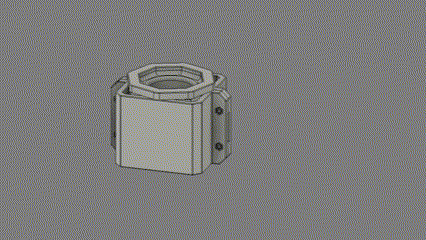
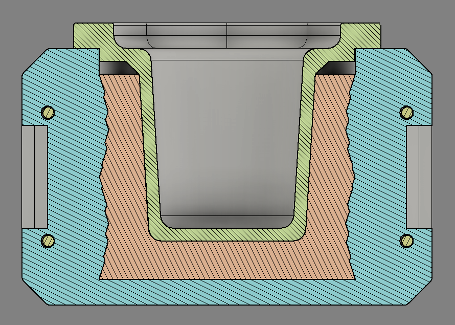

---
hide:
    - toc
---

# MT09

Moldes

El MT09 es sobre Moldes.

<iframe width="688" height="388" src="https://youtu.be/zyiBXNGpuJs" title="YouTube video player" frameborder="0" allow="accelerometer; autoplay; clipboard-write; encrypted-media; gyroscope; picture-in-picture; web-share" referrerpolicy="strict-origin-when-cross-origin" allowfullscreen=""></iframe>

[Paso a paso Molde MT09](https://youtu.be/zyiBXNGpuJs)

¡Muchas gracias por su atención!

<meta charset="UTF-8">
    <meta name="viewport" content="width=device-width, initial-scale=1.0">
    <title>Texto Arcoíris</title>
    
<meta charset="UTF-8">
    <meta name="viewport" content="width=device-width, initial-scale=1.0">

<html lang="en">