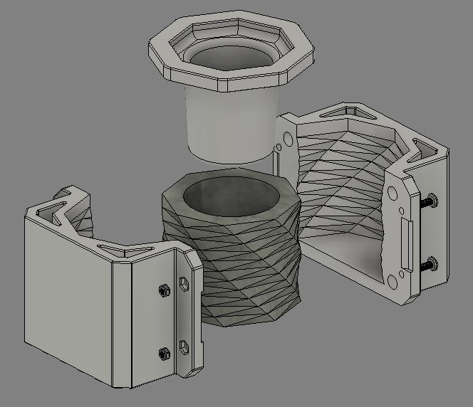

---
hide:
    - toc
---

# MT09

Moldes

El MT09 consiste en diseñar y modelar una maceta utilizando el software Fusion 360, respetando las dimensiones máximas de 10 cm de alto y 15 cm de diámetro. Luego, se debe crear un molde para fabricar dicha maceta. El molde puede tener entre 1 y 4 caras, y debe incluir guías de encastre si tiene varias piezas. Además, es importante aplicar un ángulo de desmoldeo en todas las superficies del molde para facilitar su fabricación.

Video del paso a paso del diseño

<iframe width="560" height="315" 
        src="https://www.youtube.com/embed/zyiBXNGpuJs" 
        title="YouTube video player" 
        frameborder="0" 
        allow="accelerometer; autoplay; clipboard-write; encrypted-media; gyroscope; picture-in-picture" 
        allowfullscreen>
</iframe>

Animación explotada del Molde

Análisis por corte

Se utiliza un leve ángulo de desmoldeo en la tercer parte del molde (tapa superior), ya que es la primer y único componente que debe extraerse mediante movimiento de "deslizamiento".

Lógica del diseño

El molde está compuesto por 3 partes principales;

1- Mitad A: Posee las canalizaciones macho para alinearlo a su otra mitad y también orificios hexagonales para tuercas que se utilizan como insertos roscados.
2- Mitad B: Posee las canalizaciones hembra para alinearlo a su otra mitad y orificios pasantes para tornillos que se ensamblan a las tuercas de la otra mitad.
3- Mitad C (Tapa): Posee un leve ángulo para facilitar el desmoldeo y una extrusión hexagonal que sea corresponde con el hueco que se forma al juntar los moldes, para asegurarnos que el "vaciado" de la maceta siempre quede centrado.

Cómo considerciones generales, se generan cortes y substracciones en búsqueda de aprovechamiento del material.

[Link de descarga a la versión final de la Entrega MT09](https://drive.google.com/file/d/1Ld-aIAoDlUrG2lfw4dnN6EB_tkfmeIMx/view?usp=sharing)

¡Muchas gracias por su atención!

<meta charset="UTF-8">
    <meta name="viewport" content="width=device-width, initial-scale=1.0">
    <title>Embed YouTube Video</title>

<meta charset="UTF-8">
    <meta name="viewport" content="width=device-width, initial-scale=1.0">
    <title>Texto Arcoíris</title>
        

<html lang="en">